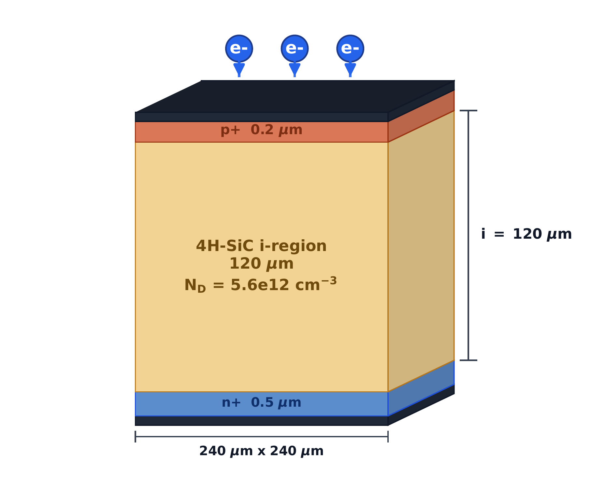
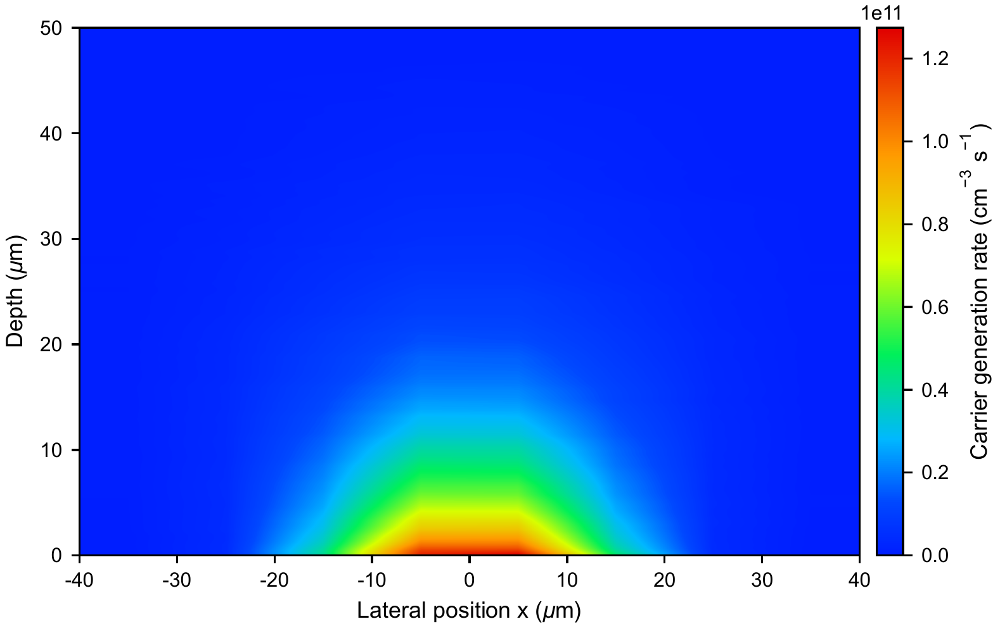
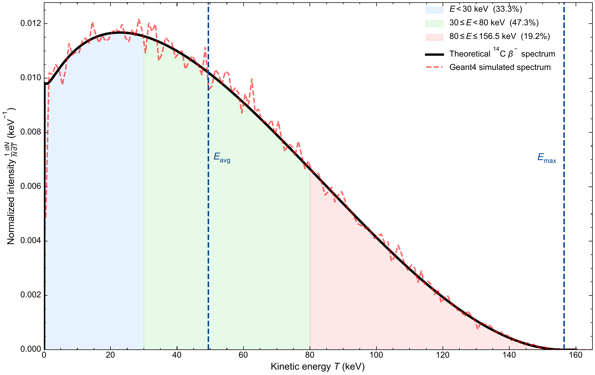
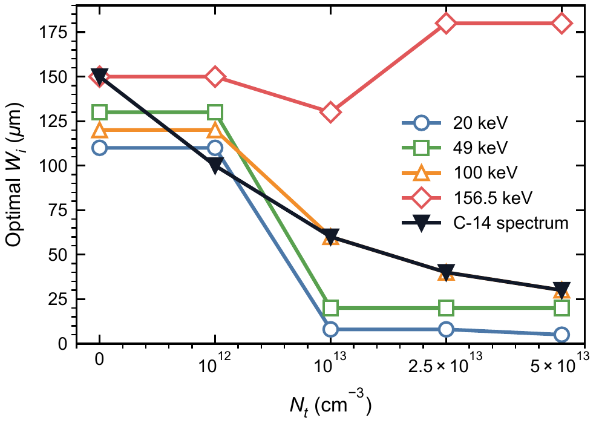

## Abstract

4H-SiC combines a wide bandgap, low dark current, and high radiation tolerance, making it suitable for low-energy beta detectors. For $^{14}\mathrm{C}$ detectors, the continuous beta spectrum and deep-level defects in the epitaxial layer jointly affect the choice of device thickness. In this work, the energy-deposition distribution obtained with Geant4 is mapped into a transient carrier-generation source term in TCAD, and charge collection efficiency (CCE) is used as the evaluation metric to determine the optimum i-region thickness of 4H-SiC PIN detectors under different epitaxial material qualities. The model includes both $Z_{1/2}$ and $\mathrm{EH}_{6/7}$ bulk traps, and devices are compared over a cross-design space of device thickness and defect density. The results show that, in ideal or low-defect epitaxial layers, the CCE approaches saturation as the i-region thickness increases. When the trap density increases, trapping loss in thick devices makes the CCE nonmonotonic. The optimum thickness for the $^{14}\mathrm{C}$ continuous spectrum gradually decreases from $150\ \mu\mathrm{m}$ to $30\ \mu\mathrm{m}$, and the corresponding optimum CCE decreases from 97.80% to 81.72%. Cross-evaluation with single-energy source terms indicates that mean-energy or endpoint-energy approximations can cause significant thickness-selection bias under some defect conditions. Therefore, the thickness design of 4H-SiC $^{14}\mathrm{C}$ detectors should consider both the true beta spectral shape and the epitaxial material quality, rather than relying only on the electron range at a single energy.

**Keywords:** 4H-SiC; PIN detector; $^{14}\mathrm{C}$; Geant4; TCAD; effective charge collection efficiency; epitaxial defects

## 1. Introduction

Monitoring of $^{14}\mathrm{C}$ is relevant to nuclear facility decommissioning, low-level radioactive waste characterization, biomedical tracer studies, and environmental background monitoring. Liquid scintillation counters and gas-flow counters provide mature metrological capability, but they usually require relatively large peripheral systems and reagent or gas handling. For portable and long-term online monitoring, solid-state semiconductor detectors are attractive because of their compact structure, low maintenance requirement, and ease of system integration.

4H-SiC is a representative wide-bandgap material for low-energy radiation detectors. Its bandgap is about $3.26\ \mathrm{eV}$, which is favorable for low dark current operation at room temperature. Its high critical breakdown field enables a relatively thick depletion region under reverse bias, and its high displacement threshold energy and good chemical stability are also suitable for long-term irradiation environments. Previous studies have shown that 4H-SiC PIN, p-n junction, or Schottky devices can be used for alpha particles, X-rays, minimum ionizing particles (MIPs), heavy ions, and beta sources [1-14]. The $^{14}\mathrm{C}$ beta spectrum is continuously distributed from near-zero energy to $156.5\ \mathrm{keV}$. Low-energy electrons mainly deposit energy near the surface, whereas the high-energy tail can produce deeper energy deposition in SiC. For a PIN detector, a thicker i-region helps cover the high-energy tail, but it also increases the carrier drift distance and collection time. Epitaxial defects further strengthen this tradeoff. The common $Z_{1/2}$ and $\mathrm{EH}_{6/7}$ deep levels in 4H-SiC epitaxial layers reduce charge collection efficiency through SRH recombination and trapping, and their effect is more pronounced in thick i-regions. Therefore, the optimum thickness of a $^{14}\mathrm{C}$ detector should not be determined only by electron range, but by the continuous-spectrum deposition, epitaxial defect density, and device electric field together.

This work combines Geant4 low-energy electron transport with TCAD transient device response to study thickness optimization of 4H-SiC PIN $^{14}\mathrm{C}$ detectors. Geant4 provides the energy deposition of the $^{14}\mathrm{C}$ continuous spectrum and the $20$, $49$, $100$, and $156.5\ \mathrm{keV}$ single-energy source terms in SiC, which is then converted into carrier-generation distributions in TCAD. The TCAD model uses key physical models including drift-diffusion transport and SRH recombination, and represents the epitaxial material quality by two types of bulk traps, $Z_{1/2}$ and $\mathrm{EH}_{6/7}$.

Compared with previous simulation studies of SiC detectors, this work focuses more on the coupled relation among the $^{14}\mathrm{C}$ continuous spectrum, i-region thickness, and epitaxial defect density. Moscatelli et al. mainly focused on experimental-simulation comparison of CCE in SiC junction detectors [6], He et al. emphasized transient response in SiC alpha-particle detectors [7], and Kim et al. discussed structural optimization and trap effects in 4H-SiC betavoltaic devices [15]. Other 4H-SiC betavoltaic studies also indicate that beta-source energy deposition, source self-absorption, device layer thickness, and recombination loss jointly determine device output performance [16-20]. For $^{14}\mathrm{C}$ beta detectors, this work provides a CCE-thickness-$N_t$ design scheme and further quantifies the thickness-selection bias introduced when a single-energy source term is used to replace the true continuous spectrum.

## 2. Model and simulation method

### 2.1 4H-SiC PIN device structure

This work studies a vertically incident 4H-SiC PIN detector. The device consists of a top $p^+$ entrance layer, a lightly doped i-region, and a bottom $n^+$ contact layer. Beta electrons enter the device from the $p^+$ side. The $p^+$ layer thickness is $0.2\ \mu\mathrm{m}$, the $n^+$ layer thickness is $0.5\ \mu\mathrm{m}$, and the lateral size is $240\ \mu\mathrm{m}\times240\ \mu\mathrm{m}$. The i-region thickness $W_i$ is the main design variable and spans $5$-$180\ \mu\mathrm{m}$. The net doping concentration in the i-region is $5.6\times10^{12}\ \mathrm{cm^{-3}}$, and the doping concentrations of the $p^+$ and $n^+$ regions are $1\times10^{19}\ \mathrm{cm^{-3}}$.

{width=54%}

**Table 1. Device structure and material parameters.**

| Parameter | Value |
| --- | ---: |
| $p^+$ thickness | $0.2\ \mu\mathrm{m}$ |
| i-region thickness | $5$, $8$, $10$-$130$, $150$, and $180\ \mu\mathrm{m}$ |
| $n^+$ thickness | $0.5\ \mu\mathrm{m}$ |
| Lateral size | $240\ \mu\mathrm{m}\times240\ \mu\mathrm{m}$ |
| Net i-region doping | $5.6\times10^{12}\ \mathrm{cm^{-3}}$ |
| $p^+$ / $n^+$ doping | $1\times10^{19}\ \mathrm{cm^{-3}}$ |

For each $W_i$, transient response calculations are performed at the corresponding full-depletion bias so that devices with different thicknesses are compared under the same depletion condition. The analytical estimate of the depletion voltage is

$$
V_{\mathrm{dep}}(W_i)=\frac{qN_DW_i^2}{2\varepsilon_{\mathrm{SiC}}}.
$$

### 2.2 Geant4 energy deposition and TCAD carrier-generation source term

Geant4 is used to calculate the transport and energy deposition of $^{14}\mathrm{C}$ beta electrons and monoenergetic electrons in 4H-SiC [11,16,21,22]. The $^{14}\mathrm{C}$ source term is sampled according to the beta-decay spectrum, with a maximum energy of $156.5\ \mathrm{keV}$ and an average energy of about $49\ \mathrm{keV}$. The comparison source terms are $20$, $49$, $100$, and $156.5\ \mathrm{keV}$ monoenergetic electrons. The theoretical spectral shape can be written as

$$
\frac{dN}{dT}\propto F(Z,T)\,p\,(T+m_ec^2)(E_0-T)^2,
$$

where $T$ is the electron kinetic energy, $p$ is the momentum, $E_0=156.5\ \mathrm{keV}$ is the endpoint energy, and $F(Z,T)$ is the Fermi-function correction. Geant4 records the energy deposited by electrons in SiC step by step and normalizes it to a single incident particle. The spatial distribution is then converted into the two-dimensional carrier-generation rate $G(x,y)$ used as the transient source term in TCAD.

{width=90%}

The conversion from energy deposition to generated carriers uses the average electron-hole pair creation energy in 4H-SiC, $E_{eh}=7.8\ \mathrm{eV}$ [23]:

$$
N_{eh}=\frac{E_{\mathrm{dep}}}{E_{eh}}.
$$

The Geant4 output $E_{\mathrm{dep}}$ is binned by depth and lateral position and interpolated onto the TCAD mesh to form $G(x,y)$. Because electrons scatter strongly in SiC, this work retains the two-dimensional deposition distribution instead of applying lateral averaging. Fig.3 shows a typical generation-rate distribution used in TCAD.

{width=70%}

To determine the additional error that may be introduced during the Geant4-to-TCAD conversion, this work compares the electron-hole-pair number obtained from the Geant4 deposited energy with the integral of the TCAD generation rate. The electron-hole-pair number calculated from the Geant4 deposited energy is

$$
N_{eh}^{\mathrm{Geant4}}=\frac{\langle E_{\mathrm{dep}}\rangle}{E_{eh}},
$$

and the mapped generation-rate integral is

$$
N_{eh}^{\mathrm{TCAD}}=\int G\,dV\,dt.
$$

The comparison is listed in Table 2. The two values agree within numerical precision, indicating that the normalized charge used in the subsequent CCE calculation keeps the same reference as the Geant4 deposited energy.

**Table 2. Normalization consistency between Geant4 deposited energy and TCAD generation rate.**

| Source | $N_{eh}^{\mathrm{Geant4}}$ | $N_{eh}^{\mathrm{TCAD}}$ | Relative error (%) |
| :-: | --: | --: | --: |
| $20\ \mathrm{keV}$ | $2.353\times10^3$ | $2.353\times10^3$ | $-1.93\times10^{-14}$ |
| $49\ \mathrm{keV}$ | $5.805\times10^3$ | $5.805\times10^3$ | $3.13\times10^{-14}$ |
| $100\ \mathrm{keV}$ | $1.191\times10^4$ | $1.191\times10^4$ | $0$ |
| $156.5\ \mathrm{keV}$ | $1.875\times10^4$ | $1.875\times10^4$ | $-1.94\times10^{-14}$ |
| $^{14}\mathrm{C}$ spectrum | $5.919\times10^3$ | $5.919\times10^3$ | $0$ |

### 2.3 TCAD physical model

The TCAD simulation solves the Poisson equation and the electron and hole continuity equations:

$$
\nabla\cdot(\varepsilon\nabla\psi)=-q(p-n+N_D^+-N_A^-),
$$

$$
\frac{\partial n}{\partial t}=\frac{1}{q}\nabla\cdot J_n+G-R,\qquad
\frac{\partial p}{\partial t}=-\frac{1}{q}\nabla\cdot J_p+G-R.
$$

The carrier currents are described by the drift-diffusion form:

$$
J_n=q\mu_n nE+qD_n\nabla n,\qquad
J_p=q\mu_p pE-qD_p\nabla p.
$$

The model includes 4H-SiC anisotropic mobility, doping-dependent mobility, high-field saturation, and incomplete ionization. In defective materials, the $Z_{1/2}$ and $\mathrm{EH}_{6/7}$ deep levels are introduced into the i-region as uniform bulk traps. All thickness scans use the same material parameters and boundary conditions; the only differences are the i-region thickness, full-depletion bias, source-term spatial distribution, and trap concentration.

### 2.4 Deep-level defect model in the epitaxial layer

This work uses a literature-constrained two-center SRH bulk-defect model to describe the epitaxial material quality. $Z_{1/2}$ and $\mathrm{EH}_{6/7}$ are common carbon-vacancy-related deep levels in n-type or lightly doped 4H-SiC epitaxial layers, and they usually limit minority-carrier lifetime and reduce charge-collection performance [24-33]. The model parameters are listed in Table 3. Here, $N_t$ denotes the uniform bulk concentration of each defect center in the i-region, namely $N_{Z_{1/2}}=N_{\mathrm{EH}_{6/7}}=N_t$.

**Table 3. SRH bulk-trap parameters used in the TCAD simulation.**

| Center | TCAD type | Energy level | $\sigma_e$ ($\mathrm{cm^2}$) | $\sigma_h$ ($\mathrm{cm^2}$) | Concentration | Source |
| :-: | :-: | :-: | :--: | :--: | :--: | :-: |
| $Z_{1/2}$ | Acceptor | $E_c-0.67\ \mathrm{eV}$ | $2\times10^{-14}$ | $1\times10^{-15}$ | $N_t$ | Gaggl et al.; Capan |
| $\mathrm{EH}_{6/7}$ | Donor | $E_c-1.55\ \mathrm{eV}$ | $2\times10^{-14}$ | $1\times10^{-15}$ | $N_t$ | Kleppinger et al.; Gaggl et al. |

The energy level and electron capture cross section of $Z_{1/2}$ follow the values used in the TCAD defect model of Gaggl et al. [26]; its relation to carbon vacancies and lifetime limitation is supported by related defect studies [31,32]. The energy level of $\mathrm{EH}_{6/7}$ uses a representative value within the range extracted by Kleppinger et al. from DLTS measurements and is close to the $E_c-1.60\ \mathrm{eV}$ value used by Gaggl et al. [25,26,28,29]. Because reported capture cross sections vary with material and extraction method, this work fixes $\sigma_e$ and $\sigma_h$ and uses $N_t$ as an effective parameter for epitaxial material quality. Under the low-injection approximation, the trap-limited capture time can be roughly expressed as

$$
\tau_{n,p}^{\mathrm{trap}}\approx \frac{1}{v_{\mathrm{th}}\sigma_{n,p}N_t},
$$

where $v_{\mathrm{th}}$ is the thermal velocity. This expression indicates that increasing $N_t$ or the capture cross section shortens the effective lifetime, thereby causing more pronounced charge loss along long drift paths in thick i-regions. The scanned defect densities are

$$
N_t = 0,\ 10^{12},\ 10^{13},\ 2.5\times10^{13},\ 5\times10^{13}\ \mathrm{cm^{-3}}.
$$

Here, $N_t=0$ is used as the ideal-material reference, and the other values represent effective epitaxial material conditions from low-defect to strongly trap-limited cases.

## 3. Results and discussion

### 3.1 $^{14}\mathrm{C}$ beta spectrum and energy-deposition distribution

Fig.4 shows the theoretical $^{14}\mathrm{C}$ beta spectrum and the Geant4 sampled result. The $^{14}\mathrm{C}$ beta spectrum covers a continuous energy range from near zero to $156.5\ \mathrm{keV}$.

{width=52%}

Fig.5 compares the depth-dependent energy-deposition distributions of the $^{14}\mathrm{C}$ continuous spectrum and several single-energy source terms in 4H-SiC. Low-energy electrons mainly deposit energy near the surface, whereas high-energy electrons have a deeper penetration tail. The $^{14}\mathrm{C}$ continuous spectrum contains both contributions and therefore cannot be completely represented by a single energy.

{width=50%}

To verify the depth scale produced by Geant4 low-energy electron transport, this work further compares the Geant4 one-dimensional depth-deposition distribution with NIST ESTAR [34]. In the table, $z_{50}$ and $z_{90}$ denote the depths at which the cumulative deposited energy reaches 50% and 90%, respectively, and $R_{\mathrm{CSDA}}$ is converted from the ESTAR mass thickness.

**Table 4. Geant4 one-dimensional depth-deposition distribution and ESTAR electron range benchmark.**

| Energy | ESTAR $R_{\mathrm{CSDA}}$ ($\mu\mathrm{m}$) | Geant4 $z_{50}$ ($\mu\mathrm{m}$) | Geant4 $z_{90}$ ($\mu\mathrm{m}$) | $E_{\mathrm{dep}}/E_{\mathrm{in}}$ |
| :-: | --: | --: | --: | --: |
| $20\ \mathrm{keV}$ | 3.44 | 0.98 | 1.95 | 0.918 |
| $49\ \mathrm{keV}$ | 16.35 | 4.93 | 9.56 | 0.924 |
| $100\ \mathrm{keV}$ | 55.36 | 16.87 | 32.61 | 0.929 |
| $156.5\ \mathrm{keV}$ | 115.94 | 35.09 | 67.23 | 0.934 |

The four energy points in Table 4 have consistent magnitude and monotonic trends, indicating that the low-energy electron penetration depths given by Geant4 are compatible with the ESTAR benchmark.

### 3.2 Device electrical characterization

Before the CCE thickness scan, the baseline device is first confirmed to reach full depletion under the specified bias. Fig.6 shows the $1/C^2$-$V$ and $C$-$V$ characteristics of the device with $W_i=120\ \mu\mathrm{m}$.

{width=62%}

In Fig.6, $1/C^2$ enters a plateau after about $75\ \mathrm{V}$. The capacitance in the inset also approaches the geometrical capacitance level of $4.11\times10^{-14}\ \mathrm{F}$, which is consistent with the estimated value $C_{\mathrm{geo}}=\varepsilon_{\mathrm{SiC}}A/W_i=4.12\times10^{-14}\ \mathrm{F}$. Therefore, $75\ \mathrm{V}$ can be used as the full-depletion operating bias for the $120\ \mu\mathrm{m}$ baseline device.

### 3.3 Effect of defects on the $^{14}\mathrm{C}$ CCE-thickness relation

Fig.7 shows the effective CCE under the $^{14}\mathrm{C}$ continuous spectrum as a function of i-region thickness and bulk defect density $N_t$.

{width=66%}

In ideal and low-defect materials, CCE rises rapidly from the thin side and enters a near-saturation region after $W_i\approx100\ \mu\mathrm{m}$. As $N_t$ increases, the carrier drift path in the thick region becomes longer and trapping loss becomes more pronounced, so the CCE changes from a monotonic saturation trend to a nonmonotonic function. The optimum $^{14}\mathrm{C}$ thickness therefore gradually retracts from the thick-side plateau to 60, 40, and $30\ \mu\mathrm{m}$.

Fig.8 summarizes the CCE results under the $^{14}\mathrm{C}$ continuous spectrum as a design map, showing the trend that the high-CCE region shifts toward thinner devices as the defect density increases.

{width=63%}

### 3.4 Optimum thickness under different source terms

To compare single-energy source terms with the $^{14}\mathrm{C}$ continuous spectrum, this work calculates the i-region thickness that maximizes CCE under five source terms: $20$, $49$, $100$, $156.5\ \mathrm{keV}$, and $^{14}\mathrm{C}$. Fig.9 shows the optimum thickness as a function of $N_t$.

{width=58%}

Fig.9 shows that the optimum thicknesses predicted by different source terms are not the same. At low defect density, most source terms lie on the thick-side plateau; after the defect density increases, the low-energy single-energy source terms quickly shift toward the thin side. The optimum points for each source term are listed in Table 5.

**Table 5. Optimum points determined by the maximum CCE under different source terms and defect densities. Each cell is the optimum $W_i$ ($\mu\mathrm{m}$) / optimum CCE (%).**

| $N_t$ ($\mathrm{cm^{-3}}$) | $20\ \mathrm{keV}$ | $49\ \mathrm{keV}$ | $100\ \mathrm{keV}$ | $156.5\ \mathrm{keV}$ | $^{14}\mathrm{C}$ |
| :--: | :--: | :--: | :--: | :--: | :--: |
| 0 | 110 / 74.24 | 130 / 97.74 | 120 / 99.41 | 150 / 99.62 | 150 / 97.80 |
| $10^{12}$ | 110 / 74.19 | 130 / 97.67 | 120 / 99.35 | 150 / 99.56 | 100 / 97.72 |
| $10^{13}$ | 8 / 73.88 | 20 / 97.48 | 60 / 97.39 | 130 / 72.37 | 60 / 95.09 |
| $2.5\times10^{13}$ | 8 / 73.82 | 20 / 97.21 | 40 / 80.54 | 180 / 52.03 | 40 / 87.14 |
| $5\times10^{13}$ | 5 / 73.78 | 20 / 96.59 | 30 / 66.87 | 180 / 37.69 | 30 / 81.72 |

### 3.5 Design bias caused by the single-energy approximation

To quantitatively evaluate the design error introduced by replacing the $^{14}\mathrm{C}$ continuous spectrum with monoenergetic electrons, this work fixes the actual incident source term as $^{14}\mathrm{C}$ and compares the CCE achievable under $^{14}\mathrm{C}$ when the optimum thickness determined by each single-energy source term at each $N_t$ is used. Fig.10 presents this cross-evaluation result as a two-dimensional matrix: the horizontal axis is the defect density $N_t$, the vertical axis is the single-energy design source, and the color and cell value represent the CCE loss relative to direct optimization using the $^{14}\mathrm{C}$ continuous spectrum.

{width=55%}

Fig.10 shows that, at low defect density, the loss caused by using different design source terms for $^{14}\mathrm{C}$ is below 0.1 percentage points, because the thick-side saturation region masks the source-term difference. After the defect density increases, the single-energy approximation error is amplified: designs based on $20\ \mathrm{keV}$ or $156.5\ \mathrm{keV}$ can cause about 35-45 percentage points of CCE loss in the high-defect region. Under the present parameters, $100\ \mathrm{keV}$ gives the same thickness as the $^{14}\mathrm{C}$ continuous spectrum, but this is only a result of the current structure and scan grid. Directly using the true continuous spectrum remains the more robust thickness-optimization method.

## 4. Design implications and model limitations

### 4.1 Material-quality-driven design recommendation

Table 5 gives the $^{14}\mathrm{C}$ thickness selection results under material-quality constraints. Low-defect materials can use the $100$-$150\ \mu\mathrm{m}$ thick-side plateau. When the defect density increases, the high-CCE region should retract toward 60, 40, and $30\ \mu\mathrm{m}$. It should be noted that thick-side structures are mainly used to reveal the physical trend and do not imply that all thicknesses have the same system-level feasibility. Practical devices must also consider full-depletion bias, leakage current, high-voltage supply, and packaging reliability.

### 4.2 Model limitations

This work performs basic validation of the low-energy electron deposition scale, source-term conversion, and baseline device electrical state through ESTAR comparison, source-term checking, and C-V full-depletion verification, but several limitations remain.

First, the present geometry does not explicitly include metal windows, packaging windows, surface contamination layers, or a detailed surface recombination model; these factors may significantly affect the near-surface response of low-energy electrons on the order of $20\ \mathrm{keV}$, and similar beta-source device studies also show that source-term deposition, surface recombination, and device layer thickness jointly affect device response [19]. Second, the defect model includes only the two dominant centers $Z_{1/2}$ and $\mathrm{EH}_{6/7}$ and assumes equal concentrations for the two; the relative concentrations, capture cross sections, and energy-level positions of the two centers have not yet been scanned. Third, this work only considers room-temperature conditions; the effects of temperature on mobility, lifetime, incomplete ionization, and trap capture dynamics require further study.

## 5. Conclusions

This work studied the joint influence of the $^{14}\mathrm{C}$ continuous beta spectrum and deep-level defects in the epitaxial layer on the i-region thickness selection of 4H-SiC PIN detectors, and defined the optimization metric as source-normalized effective CCE. The Geant4 results show that the deposition distribution of $^{14}\mathrm{C}$ in SiC contains both shallow low-energy contributions and a deeper high-energy tail, and cannot be completely replaced by the $49\ \mathrm{keV}$ mean energy or the $156.5\ \mathrm{keV}$ endpoint energy.

When effective CCE is used as the optimization metric, CCE tends to saturate as the thickness increases in ideal or low-defect materials. After introducing the $Z_{1/2}$ and $\mathrm{EH}_{6/7}$ deep-level defects, thick-side trapping loss is enhanced and CCE changes into a nonmonotonic function. As $N_t$ increases, the optimum $^{14}\mathrm{C}$ thickness retracts from 150 and $100\ \mu\mathrm{m}$ to 60, 40, and $30\ \mu\mathrm{m}$, and the corresponding optimum effective CCE decreases from about 97.8% to 81.7%.

The thickness-design error caused by the single-energy approximation increases with defect density. In low-defect materials, the cross-source CCE loss is usually below 0.1 percentage points. In high-defect materials, replacing $^{14}\mathrm{C}$ with $20\ \mathrm{keV}$ or $156.5\ \mathrm{keV}$ can cause CCE losses on the order of 35-45 percentage points. Therefore, thickness design of 4H-SiC PIN $^{14}\mathrm{C}$ detectors should preferentially use the true continuous beta spectrum and determine the practically achievable i-region thickness together with the epitaxial material quality. Future work should supplement sensitivity analysis of trap parameters, bias, and readout time window, as well as waveform and CCE calibration of experimental devices.

## References

\begingroup
\small

[1] T. Kimoto and J. A. Cooper, *Fundamentals of Silicon Carbide Technology: Growth, Characterization, Devices, and Applications*, Wiley, 2014. doi: 10.1002/9781118313534.

[2] F. Nava, G. Bertuccio, A. Cavallini, and E. Vittone, "Silicon carbide and its use as a radiation detector material," *Measurement Science and Technology*, vol. 19, 102001, 2008. doi: 10.1088/0957-0233/19/10/102001.

[3] M. De Napoli, "SiC detectors: A review on the use of silicon carbide as radiation detection material," *Frontiers in Physics*, vol. 10, 898833, 2022. doi: 10.3389/fphy.2022.898833.

[4] M. V. Dolgopolov and A. S. Chipura, "Heterojunction betavoltaic Si14C-Si energy converter," *Journal of Power Sources*, vol. 613, 234896, 2024. doi: 10.1016/j.jpowsour.2024.234896.

[5] A. V. Gurskaya, M. V. Dolgopolov, and V. I. Chepurnov, "C-14 beta converter," *Physics of Particles and Nuclei*, vol. 48, pp. 941-944, 2017. doi: 10.1134/S106377961706020X.

[6] F. Moscatelli et al., "Measurements and simulations of charge collection efficiency of p+/n junction SiC detectors," *Nuclear Instruments and Methods in Physics Research A*, vol. 546, pp. 218-221, 2005. doi: 10.1016/j.nima.2005.03.048.

[7] X. He et al., "Transient behaviour analysis in silicon carbide alpha particle detector using TCAD and SRIM simulation," *Physica Scripta*, vol. 99, 075943, 2024. doi: 10.1088/1402-4896/ad5236.

[8] A. Gsponer et al., "Extraction of electron and hole drift velocities in thin 4H-SiC PIN detectors using high-frequency readout electronics," *Sensors*, vol. 25, no. 23, 7196, 2025. doi: 10.3390/s25237196.

[9] S. Tudisco, F. La Via, C. Agodi, C. Altana, G. Borghi, M. Boscardin, et al., "SiCILIA--Silicon Carbide Detectors for Intense Luminosity Investigations and Applications," *Sensors*, vol. 18, no. 7, 2289, 2018. doi: 10.3390/s18072289.

[10] G. Bertuccio, S. Binetti, S. Caccia, R. Casiraghi, A. Castaldini, A. Cavallini, et al., "Silicon carbide for alpha, beta, ion and soft X-ray high performance detectors," *Materials Science Forum*, vols. 483-485, pp. 1015-1020, 2005. doi: 10.4028/www.scientific.net/MSF.483-485.1015.

[11] T. Yang, Y. Tan, Q. Liu, S. Xiao, K. Liu, J. Zhang, et al., "Time Resolution of the 4H-SiC PIN Detector," *Frontiers in Physics*, vol. 10, 718071, 2022. doi: 10.3389/fphy.2022.718071.

[12] L. Y. Liu et al., "Properties of 4H silicon carbide detectors in the radiation detection of 86 MeV oxygen particles," *Diamond and Related Materials*, vol. 73, pp. 177-181, 2017. doi: 10.1016/j.diamond.2016.09.011.

[13] L. Liu, A. Liu, S. Bai, L. Lv, P. Jin, and X. Ouyang, "Radiation Resistance of Silicon Carbide Schottky Diode Detectors in D-T Fusion Neutron Detection," *Scientific Reports*, vol. 7, 13376, 2017. doi: 10.1038/s41598-017-13715-3.

[14] J. Wu, Y. Jiang, J. Lei, X. Fan, Y. Chen, M. Li, D. Zou, and B. Liu, "Effect of neutron irradiation on charge collection efficiency in 4H-SiC Schottky diode," *Nuclear Instruments and Methods in Physics Research A*, vol. 735, pp. 218-222, 2014. doi: 10.1016/j.nima.2013.09.041.

[15] K. M. Kim, I. M. Kang, J. H. Seo, Y. J. Yoon, and K. Kim, "Structural optimization and trap effects on the output performance of 4H-SiC betavoltaic cell," *Nanomaterials*, vol. 15, no. 21, 1625, 2025. doi: 10.3390/nano15211625.

[16] W. Yuan et al., "4H-SiC p-n junction betavoltaic micro-nuclear batteries based on 14C source with enhanced performance," *AIP Advances*, vol. 14, 115024, 2024. doi: 10.1063/5.0242271.

[17] D. Y. Qiao, W. Z. Yuan, P. Gao, X. W. Yao, B. Zang, L. Zhang, H. Guo, and H. J. Zhang, "Demonstration of a 4H SiC betavoltaic nuclear battery based on Schottky barrier diode," *Chinese Physics Letters*, vol. 25, no. 10, pp. 3798-3800, 2008. doi: 10.1088/0256-307X/25/10/076.

[18] Y. M. Liu, J. B. Lu, X. Y. Li, X. Xu, R. He, and H. D. Wang, "A 4H-SiC betavoltaic battery based on a 63Ni source," *Nuclear Science and Techniques*, vol. 29, 168, 2018. doi: 10.1007/s41365-018-0494-x.

[19] C. Thomas, S. Portnoff, and M. G. Spencer, "High efficiency 4H-SiC betavoltaic power sources using tritium radioisotopes," *Applied Physics Letters*, vol. 108, 013505, 2016. doi: 10.1063/1.4939203.

[20] X. Zhang et al., "Optimization design of 4H-SiC-based betavoltaic battery using 3H source," *AIP Advances*, vol. 12, 105302, 2022. doi: 10.1063/5.0114529.

[21] S. Agostinelli et al., "Geant4: A simulation toolkit," *Nuclear Instruments and Methods in Physics Research A*, vol. 506, pp. 250-303, 2003. doi: 10.1016/S0168-9002(03)01368-8.

[22] J. Allison et al., "Recent developments in Geant4," *Nuclear Instruments and Methods in Physics Research A*, vol. 835, pp. 186-225, 2016. doi: 10.1016/j.nima.2016.06.125.

[23] A. Gsponer et al., "Measurement of the electron-hole pair creation energy in a 4H-SiC p-n diode," *Nuclear Instruments and Methods in Physics Research A*, vol. 1064, 169412, 2024. doi: 10.1016/j.nima.2024.169412.

[24] T. Kimoto, "Bulk and epitaxial growth of silicon carbide," *Progress in Crystal Growth and Characterization of Materials*, vol. 62, no. 2, pp. 329-351, 2016. doi: 10.1016/j.pcrysgrow.2016.04.018.

[25] J. W. Kleppinger, S. K. Chaudhuri, O. F. Karadavut, R. Nag, and K. C. Mandal, "Influence of carrier trapping on radiation detection properties in CVD grown 4H-SiC epitaxial layers with varying thickness up to 250 μm," *Journal of Crystal Growth*, vol. 583, 126532, 2022. doi: 10.1016/j.jcrysgro.2022.126532.

[26] P. Gaggl et al., "TCAD modeling of radiation-induced defects in 4H-SiC diodes," *Nuclear Instruments and Methods in Physics Research A*, vol. 1070, 170015, 2025. doi: 10.1016/j.nima.2024.170015.

[27] I. Capan, "Electrically active defects in 3C, 4H, and 6H silicon carbide polytypes: A review," *Crystals*, vol. 15, no. 3, 255, 2025. doi: 10.3390/cryst15030255.

[28] S. K. Chaudhuri, J. W. Kleppinger, and K. C. Mandal, "Radiation detection using fully depleted 50 μm thick Ni/n-4H-SiC epitaxial layer Schottky diodes with ultra-low concentration of Z1/2 and EH6/7 deep defects," *Journal of Applied Physics*, vol. 128, 114501, 2020. doi: 10.1063/5.0021403.

[29] J. W. Kleppinger, S. K. Chaudhuri, O. F. Karadavut, and K. C. Mandal, "Defect characterization and charge transport measurements in high-resolution Ni/n-4H-SiC Schottky barrier radiation detectors fabricated on 250 μm epitaxial layers," *Journal of Applied Physics*, vol. 129, 244501, 2021. doi: 10.1063/5.0049218.

[30] K. C. Mandal, S. K. Chaudhuri, K. V. Nguyen, and M. A. Mannan, "Correlation of deep levels with detector performance in 4H-SiC epitaxial Schottky barrier alpha detectors," *IEEE Transactions on Nuclear Science*, vol. 61, no. 4, pp. 2338-2344, 2014. doi: 10.1109/TNS.2014.2335736.

[31] K. Kawahara, X. T. Trinh, N. T. Son, E. Janzen, J. Suda, and T. Kimoto, "Quantitative comparison between Z1/2 center and carbon vacancy in 4H-SiC," *Journal of Applied Physics*, vol. 115, 143705, 2014. doi: 10.1063/1.4871076.

[32] L. Storasta, H. Tsuchida, T. Miyazawa, and T. Ohshima, "Enhanced annealing of the Z1/2 defect in 4H-SiC epilayers," *Journal of Applied Physics*, vol. 103, 013705, 2008. doi: 10.1063/1.2829776.

[33] N. Iwamoto, B. C. Johnson, N. Hoshino, M. Ito, H. Tsuchida, K. Kojima, and T. Ohshima, "Defect-induced performance degradation of 4H-SiC Schottky barrier diode particle detectors," *Journal of Applied Physics*, vol. 113, 143714, 2013. doi: 10.1063/1.4801797.

[34] National Institute of Standards and Technology, "ESTAR: Stopping-power and range tables for electrons." https://physics.nist.gov/PhysRefData/Star/Text/ESTAR.html.

\endgroup
