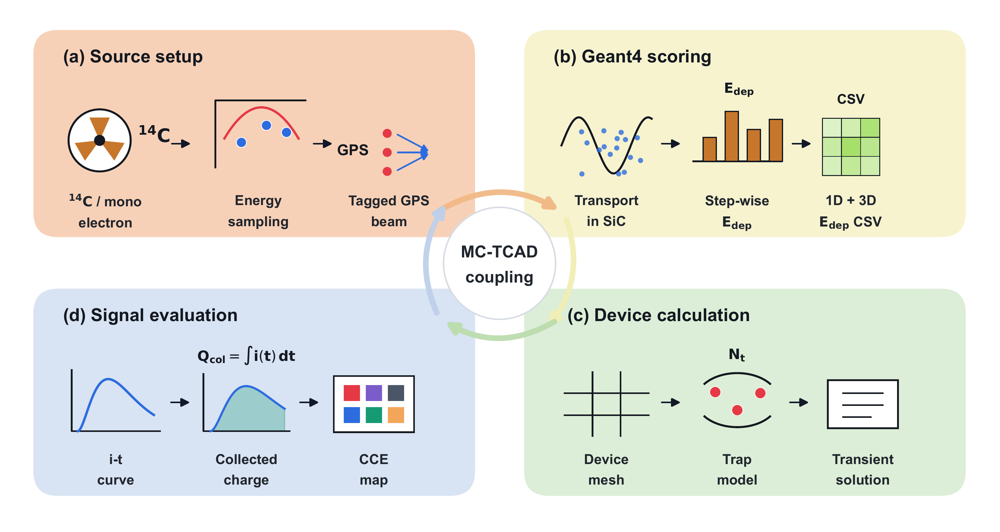
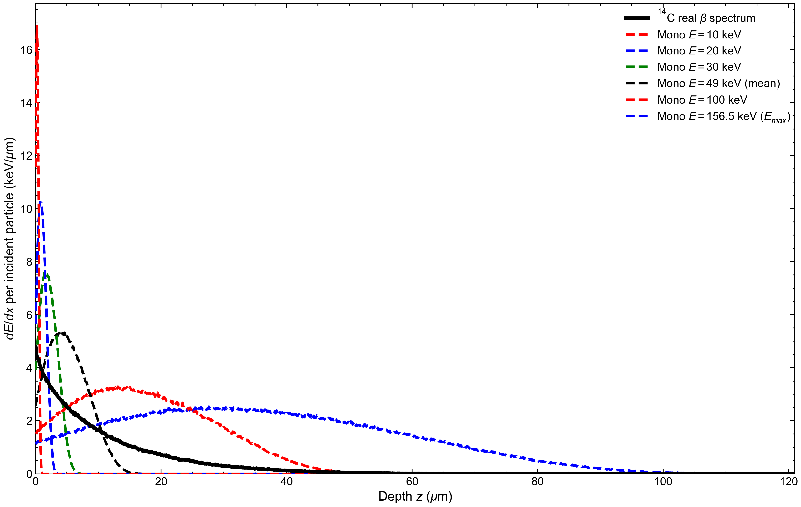
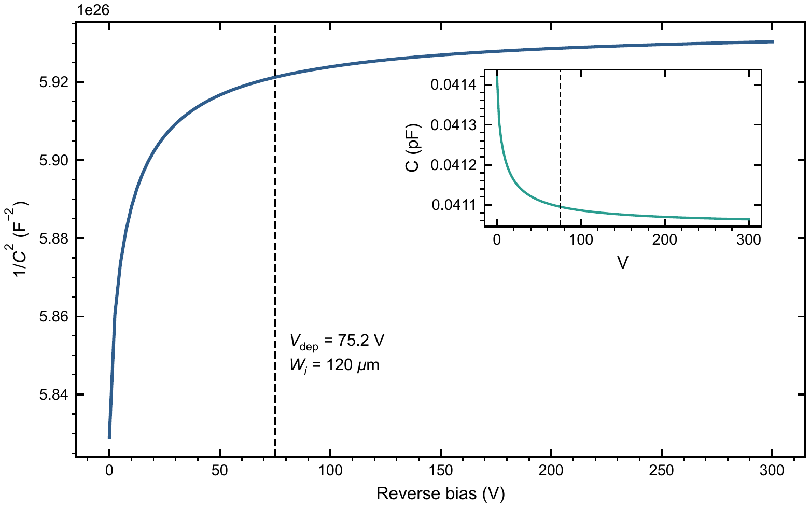
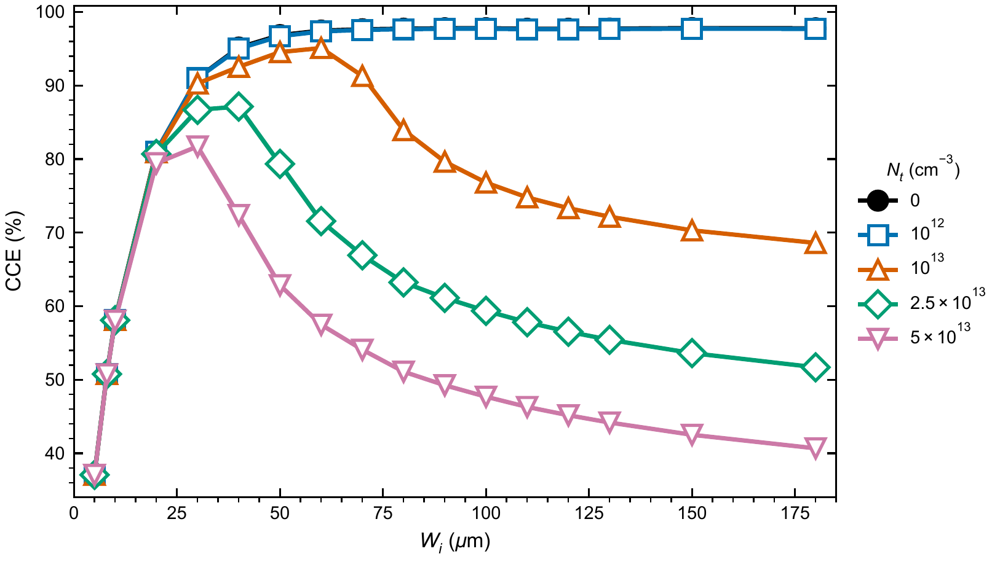
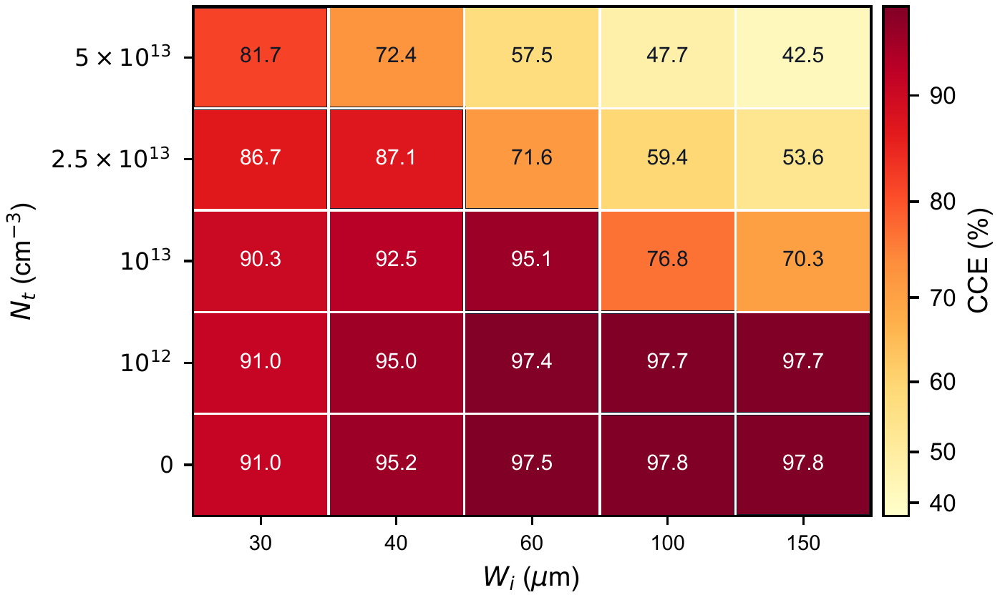
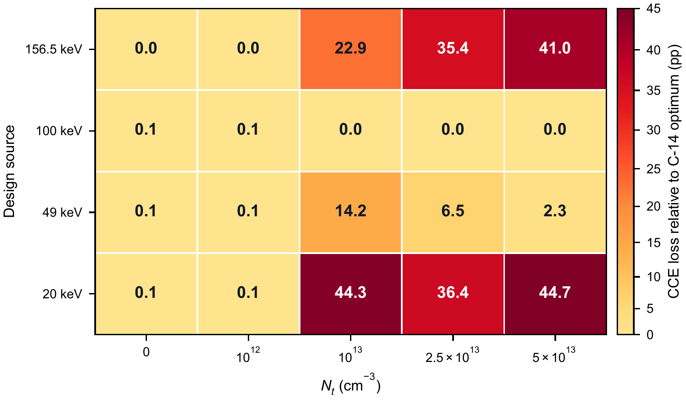

# Thickness Optimization of 4H-SiC PIN $^{14}$C Detectors under Spectral and Trap Constraints

## 摘要

4H-SiC 兼具宽禁带、低暗电流和高辐照耐受性，适用于低能 β 探测器。针对 $^{14}\mathrm{C}$ 连续 β 谱和外延层深能级缺陷共同影响器件厚度选择的问题，本文将 Geant4 得到的能量沉积分布映射为 TCAD 瞬态载流子产生项，并以电荷收集效率作为评价指标，确定不同外延材料质量下的 4H-SiC PIN 探测器的最佳 i 区厚度。模型同时考虑 $Z_{1/2}$ 和 $\mathrm{EH}_{6/7}$ 体陷阱，并在不同的器件厚度与不同缺陷密度的交叉设计空间内进行比较。结果表明，理想或低缺陷外延层中 CCE 随 i 区厚度增加后接近饱和；当陷阱密度升高时，厚器件中的俘获损失使 CCE 变为非单调函数，$^{14}\mathrm{C}$ 连续谱对应的最优厚度由 $150\ \mu\mathrm{m}$ 逐步回缩至 $30\ \mu\mathrm{m}$，对应最优 CCE 从 97.80% 降至 81.72%。单能源项交叉评估表明，平均能量或端点能量近似在部分缺陷条件下会造成显著厚度选择偏差。因此，4H-SiC $^{14}\mathrm{C}$ 探测器的厚度设计应同时考虑真实 β 谱形和外延材料质量，而不宜仅依据单能电子射程进行确定。

**关键词：** 4H-SiC；PIN 探测器；$^{14}\mathrm{C}$；Geant4；TCAD；有效电荷收集效率；外延缺陷

## 1. 引言

$^{14}\mathrm{C}$ 监测涉及核设施退役、低放废物表征、生物医学示踪剂和环境本底监测等场景。液体闪烁计数器和气流计数器具有成熟的计量能力，但通常依赖较大的外围系统以及试剂或气体处理流程。面向便携式和长期在线监测，固态半导体探测器因其结构紧凑、维护需求低和易于系统集成而具有吸引力。

4H-SiC 是低能辐射探测器中具有代表性的宽禁带材料。其禁带宽度约为 $3.26\ \mathrm{eV}$，有利于室温低暗电流工作；高临界击穿电场使较厚耗尽区在反偏条件下成为可能；较高位移阈能和良好的化学稳定性也适合长期辐照环境。已有研究表明，4H-SiC PIN、p-n 结或 Schottky 器件能够用于 α 粒子、X 射线、MIP、重离子和 β 源探测 [1-14]。

$^{14}\mathrm{C}$ β 能谱从近零能量连续分布到 $156.5\ \mathrm{keV}$。低能电子主要在近表面区域沉积，高能尾部则可在 SiC 中形成更深的能量沉积。对于 PIN 探测器，较厚的 i 区有利于覆盖高能尾部，但也会增加载流子漂移距离和收集时间。

外延层缺陷进一步强化了这种权衡。4H-SiC 外延层中常见的 $Z_{1/2}$ 和 $\mathrm{EH}_{6/7}$ 深能级会通过 SRH 复合和俘获降低载流子收集效率，其影响在厚 i 区中更为明显。因此，$^{14}\mathrm{C}$ 探测器的最佳厚度不应只由电子射程决定，而应由连续谱沉积、外延缺陷密度和器件电场共同决定。

本文将 Geant4 低能电子输运与 TCAD 器件瞬态响应相结合，研究 4H-SiC PIN $^{14}\mathrm{C}$ 探测器的厚度优化。Geant4 给出 $^{14}\mathrm{C}$ 连续谱及 $20$、$49$、$100$ 和 $156.5\ \mathrm{keV}$ 单能源项在 SiC 中的能量沉积，随后将其转换为 TCAD 中的载流子产生分布。TCAD 模型采用漂移扩散输运和 SRH 复合等关键物理模型，并通过 $Z_{1/2}$ 与 $\mathrm{EH}_{6/7}$ 两类体陷阱表征外延层材料质量。

相对于已有 SiC 探测器仿真工作，本文更关注 $^{14}\mathrm{C}$ 连续谱、i 区厚度和外延层缺陷密度之间的耦合关系。Moscatelli 等主要关注 SiC 结探测器 CCE 的实验-仿真对照 [6]，He 等侧重 α 粒子在 SiC 探测器中的瞬态响应 [7]，Kim 等讨论 4H-SiC betavoltaic 器件中的结构优化和陷阱效应 [15]；其他 4H-SiC betavoltaic 研究也表明，β 源能量沉积、源项自吸收、器件层厚和复合损失共同决定器件输出性能 [16-20]。本文面向 $^{14}\mathrm{C}$ β 探测器，给出 CCE-厚度-$N_t$ 设计方案，并进一步量化单能源项替代真实连续谱时引入的厚度选择偏差。

## 2. 模型与仿真方法

### 2.1 4H-SiC PIN 器件结构

本文研究垂直入射的 4H-SiC PIN 探测器。器件由顶部 $p^+$ 入射层、中间轻掺杂 i 区和底部 $n^+$ 接触层组成，β 电子从 $p^+$ 侧进入器件。$p^+$ 层厚度为 $0.2\ \mu\mathrm{m}$，$n^+$ 层厚度为 $0.5\ \mu\mathrm{m}$，横向尺寸为 $240\ \mu\mathrm{m}\times240\ \mu\mathrm{m}$。i 区厚度 $W_i$ 是主要设计变量，取值覆盖 $5$-$180\ \mu\mathrm{m}$。i 区净掺杂浓度为 $5.6\times10^{12}\ \mathrm{cm^{-3}}$，$p^+$ 和 $n^+$ 区掺杂浓度为 $1\times10^{19}\ \mathrm{cm^{-3}}$。

**Fig.1.** 4H-SiC PIN 探测器结构示意图。图中以 $W_i=120\ \mu\mathrm{m}$ 为参考结构展示。

**Table 1. 器件结构和材料参数。**

| 参数 | 数值 |
| --- | ---: |
| $p^+$ 厚度 | $0.2\ \mu\mathrm{m}$ |
| i 区厚度 | $5$、$8$、$10$-$130$、$150$ 和 $180\ \mu\mathrm{m}$ |
| $n^+$ 厚度 | $0.5\ \mu\mathrm{m}$ |
| 横向尺寸 | $240\ \mu\mathrm{m}\times240\ \mu\mathrm{m}$ |
| i 区净掺杂 | $5.6\times10^{12}\ \mathrm{cm^{-3}}$ |
| $p^+$ / $n^+$ 掺杂 | $1\times10^{19}\ \mathrm{cm^{-3}}$ |

对于每个 $W_i$，各厚度器件均在对应全耗尽偏压下进行瞬态响应计算，以保证不同厚度之间的比较具有相同的耗尽条件。耗尽电压的解析估算为

$$
V_{\mathrm{dep}}(W_i)=\frac{qN_DW_i^2}{2\varepsilon_{\mathrm{SiC}}}
$$

### 2.2 Geant4 能量沉积与 TCAD 载流子产生项

Geant4 用于计算 $^{14}\mathrm{C}$ β 电子和单能电子在 4H-SiC 中的输运与能量沉积 [11,16,21,22]。$^{14}\mathrm{C}$ 源项按照 β 衰变谱采样，最大能量为 $156.5\ \mathrm{keV}$，平均能量约为 $49\ \mathrm{keV}$；对照源项选取 $20$、$49$、$100$ 和 $156.5\ \mathrm{keV}$ 单能电子。理论谱形可写为

$$
\frac{dN}{dT}\propto F(Z,T)\,p\,(T+m_ec^2)(E_0-T)^2,
$$

其中 $T$ 为电子动能，$p$ 为动量，$E_0=156.5\ \mathrm{keV}$ 为端点能量，$F(Z,T)$ 为费米函数修正项。Geant4 逐步记录电子在 SiC 中的能量沉积，并以单个入射粒子为基准；随后将该空间分布转换为 TCAD 瞬态仿真中的二维载流子生成率 $G(x,y)$。

**Fig.2.** Geant4-TCAD 耦合仿真关系。Geant4 给出 β 电子在 4H-SiC 中的能量沉积分布，该分布被转换为电子-空穴对生成率并作为 TCAD 瞬态源项，最终由电流积分得到 CCE。

能量沉积到载流子产生量的转换采用 4H-SiC 平均电子-空穴对产生能量 $E_{eh}=7.8\ \mathrm{eV}$ [23]：

$$
N_{eh}=\frac{E_{\mathrm{dep}}}{E_{eh}}.
$$

Geant4 输出的 $E_{\mathrm{dep}}$ 按深度和横向位置分箱，并插值到 TCAD 网格中形成 $G(x,y)$。由于电子在 SiC 中存在明显散射，本文保留二维沉积分布，而不是进行横向平均。Fig.3 展示了 TCAD 中使用的典型生成率分布。

**Fig.3.** TCAD 中的典型载流子生成率分布（单位：$\mathrm{cm^{-3}\ s^{-1}}$）。生成率在横向和深度方向均存在明显梯度，反映了低能 β 电子在 4H-SiC 中的非均匀沉积特征。

为确定从Geant4转换到TCAD可能引入的额外误差，本文比较了 Geant4 沉积能量对应的电子-空穴对数和 TCAD 生成率积分。由 Geant4 沉积能量得到的电子-空穴对数为

$$
N_{eh}^{\mathrm{Geant4}}=\frac{\langle E_{\mathrm{dep}}\rangle}{E_{eh}}
$$

与映射生成率积分

$$
N_{eh}^{\mathrm{TCAD}}=\int G\,dV\,dt
$$

比较结果列于 Table 2。两者在数值精度内高度一致，说明后续 CCE 计算中的归一化电荷与 Geant4 沉积能量保持同一基准。

**Table 2. Geant4 沉积能量与 TCAD 生成率的归一化一致性。**

| Source | $N_{eh}^{\mathrm{Geant4}}$ | $N_{eh}^{\mathrm{TCAD}}$ | Relative error (%) |
| :-: | --: | --: | --: |
| $20\ \mathrm{keV}$ | $2.353\times10^3$ | $2.353\times10^3$ | $-1.93\times10^{-14}$ |
| $49\ \mathrm{keV}$ | $5.805\times10^3$ | $5.805\times10^3$ | $3.13\times10^{-14}$ |
| $100\ \mathrm{keV}$ | $1.191\times10^4$ | $1.191\times10^4$ | $0$ |
| $156.5\ \mathrm{keV}$ | $1.875\times10^4$ | $1.875\times10^4$ | $-1.94\times10^{-14}$ |
| $^{14}\mathrm{C}$ spectrum | $5.919\times10^3$ | $5.919\times10^3$ | $0$ |

### 2.3 TCAD 物理模型

TCAD 仿真求解 Poisson 方程与电子、空穴连续性方程：

$$
\nabla\cdot(\varepsilon\nabla\psi)=-q(p-n+N_D^+-N_A^-),
$$

$$
\frac{\partial n}{\partial t}=\frac{1}{q}\nabla\cdot J_n+G-R,\qquad
\frac{\partial p}{\partial t}=-\frac{1}{q}\nabla\cdot J_p+G-R.
$$

载流子电流采用漂移-扩散形式：

$$
J_n=q\mu_n nE+qD_n\nabla n,\qquad
J_p=q\mu_p pE-qD_p\nabla p.
$$

模型考虑 4H-SiC 各向异性迁移率、掺杂依赖迁移率、高场饱和和不完全电离。在有缺陷材料中，$Z_{1/2}$ 和 $\mathrm{EH}_{6/7}$ 深能级以均匀体陷阱形式加入 i 区。所有厚度扫描均使用同一材料参数和边界条件，差异仅来自 i 区厚度、全耗尽偏压、源项空间分布和陷阱浓度。

### 2.4 外延层深能级缺陷模型

本文采用文献约束的两中心 SRH 体缺陷模型描述外延层材料质量。$Z_{1/2}$ 和 $\mathrm{EH}_{6/7}$ 是 n 型或轻掺杂 4H-SiC 外延层中常见的碳空位相关深能级，通常会限制少子寿命并降低电荷收集性能 [24-33]。模型参数列于 Table 3，其中 $N_t$ 表示每一类缺陷中心在 i 区中的均匀体浓度，即 $N_{Z_{1/2}}=N_{\mathrm{EH}_{6/7}}=N_t$。

**Table 3. TCAD 仿真采用的 SRH 体陷阱参数。**

| Center | TCAD type | Energy level | $\sigma_e$ ($\mathrm{cm^2}$) | $\sigma_h$ ($\mathrm{cm^2}$) | Concentration | Source |
| :-: | :-: | :-: | :--: | :--: | :--: | :-: |
| $Z_{1/2}$ | Acceptor | $E_c-0.67\ \mathrm{eV}$ | $2\times10^{-14}$ | $1\times10^{-15}$ | $N_t$ | Gaggl et al.; Capan; Kawahara et al.; Storasta et al. |
| $\mathrm{EH}_{6/7}$ | Donor | $E_c-1.55\ \mathrm{eV}$ | $2\times10^{-14}$ | $1\times10^{-15}$ | $N_t$ | Kleppinger et al.; Gaggl et al.; Chaudhuri et al. |

$Z_{1/2}$ 的能级和电子俘获截面采用 Gaggl 等 TCAD 缺陷模型中的取值 [26]；其与碳空位相关性及寿命限制作用可由相关缺陷研究支持 [31,32]。$\mathrm{EH}_{6/7}$ 能级取 Kleppinger 等 DLTS 提取范围内的代表值，并接近 Gaggl 等采用的 $E_c-1.60\ \mathrm{eV}$ [25,26,28,29]。由于文献中俘获截面会随材料和提取方法变化，本文固定 $\sigma_e$ 与 $\sigma_h$，将 $N_t$ 作为等效外延材料质量参数。在低注入近似下，陷阱俘获时间可粗略表示为

$$
\tau_{n,p}^{\mathrm{trap}}\approx \frac{1}{v_{\mathrm{th}}\sigma_{n,p}N_t},
$$

其中 $v_{\mathrm{th}}$ 为热速度。该表达式说明，增大 $N_t$ 或俘获截面会缩短有效寿命，从而使厚 i 区中长漂移路径产生更明显的电荷损失。扫描的缺陷密度为

$$
N_t = 0,\ 10^{12},\ 10^{13},\ 2.5\times10^{13},\ 5\times10^{13}\ \mathrm{cm^{-3}}.
$$

其中 $N_t=0$ 作为理想材料参考，其他取值表示从低缺陷到强陷阱限制的等效外延材料情形。

## 3. 结果与讨论

### 3.1 $^{14}\mathrm{C}$ β 谱和能量沉积分布

Fig.4 给出 $^{14}\mathrm{C}$ 理论 β 谱和 Geant4 采样结果。$^{14}\mathrm{C}$ β 谱覆盖从近零到 $156.5\ \mathrm{keV}$ 的连续能量区间。

**Fig.4.** $^{14}\mathrm{C}$ β 能谱及 Geant4 采样结果。平均能量约为 $49\ \mathrm{keV}$，最大能量为 $156.5\ \mathrm{keV}$。

Fig.5 比较了 $^{14}\mathrm{C}$ 连续谱与多个单能源项在 4H-SiC 中的深度能量沉积分布。低能电子主要在近表面沉积，高能电子具有更深穿透尾部，而 $^{14}\mathrm{C}$ 连续谱同时包含这两类贡献，因此不能由单一能量完整代表。

**Fig.5.** 不同源项在 4H-SiC 中的深度能量沉积分布。图中的 $10$ 、20和 $30\ \mathrm{keV}$ 曲线用于展示低能端沉积趋势；后续厚度优化仅选取 $20$、$49$、$100$、$156.5\ \mathrm{keV}$ 和 $^{14}\mathrm{C}$ 连续谱作为对照源项。

为校核 Geant4 低能电子输运给出的深度尺度，本文进一步将 Geant4 一维深度沉积分布与 NIST ESTAR 进行对照 [34]。表中 $z_{50}$ 和 $z_{90}$ 分别表示累计沉积能量达到 50% 和 90% 的深度，$R_{\mathrm{CSDA}}$ 由 ESTAR 质量厚度换算得到。

**Table 4. Geant4 一维深度沉积分布与 ESTAR 电子 range benchmark。**

| Energy | ESTAR $R_{\mathrm{CSDA}}$ ($\mu\mathrm{m}$) | Geant4 $z_{50}$ ($\mu\mathrm{m}$) | Geant4 $z_{90}$ ($\mu\mathrm{m}$) | $E_{\mathrm{dep}}/E_{\mathrm{in}}$ |
| :-: | --: | --: | --: | --: |
| $20\ \mathrm{keV}$ | 3.44 | 0.98 | 1.95 | 0.918 |
| $49\ \mathrm{keV}$ | 16.35 | 4.93 | 9.56 | 0.924 |
| $100\ \mathrm{keV}$ | 55.36 | 16.87 | 32.61 | 0.929 |
| $156.5\ \mathrm{keV}$ | 115.94 | 35.09 | 67.23 | 0.934 |

Table 4 中四个能量点的量级和单调趋势一致，说明 Geant4 给出的低能电子穿透深度与 ESTAR 基准相容。

### 3.2 器件电学表征

在进行 CCE 厚度扫描前，首先确认基准器件在设定偏压下进入全耗尽状态。Fig.6 给出 $W_i=120\ \mu\mathrm{m}$ 器件的 $1/C^2$-$V$ 与 $C$-$V$ 特性。

**Fig.6.** $W_i=120\ \mu\mathrm{m}$ 基准 4H-SiC PIN 器件的 $1/C^2$-$V$ 特性，插图为原始 $C$-$V$ 曲线。竖直虚线标出由一维耗尽近似得到的全耗尽电压。

Fig.6 中 $1/C^2$ 在约 $75\ \mathrm{V}$ 后进入平台；插图中的电容也接近 $4.11\times10^{-14}\ \mathrm{F}$ 的几何电容水平，与 $C_{\mathrm{geo}}=\varepsilon_{\mathrm{SiC}}A/W_i$ 估算值 $4.12\times10^{-14}\ \mathrm{F}$ 一致。因此，$75\ \mathrm{V}$ 可作为 $120\ \mu\mathrm{m}$ 基准器件的全耗尽工作偏压。

### 3.3 缺陷对 $^{14}\mathrm{C}$ CCE-厚度关系的影响

Fig.7 给出 $^{14}\mathrm{C}$ 连续谱下有效 CCE 随 i 区厚度和体缺陷密度 $N_t$ 的变化。

**Fig.7.** $^{14}\mathrm{C}$ 连续谱下 CCE 随 i 区厚度变化的曲线族，参数为陷阱密度 $N_t$。理想模型下 CCE 随厚度增加后趋于饱和；高缺陷密度下厚端俘获损失增强，CCE 变为非单调函数。

理想材料和低缺陷材料中，CCE 从薄端快速上升，并在 $W_i\approx100\ \mu\mathrm{m}$ 后进入接近饱和的区域。随着 $N_t$ 增加，厚端载流子漂移路径更长、俘获损失更明显，CCE 由单调饱和转为非单调函数。$^{14}\mathrm{C}$ 最优厚度因此从厚端平台逐步回缩到 60、40 和 $30\ \mu\mathrm{m}$。

Fig.8 将 $^{14}\mathrm{C}$ 连续谱下的 CCE 结果整理为设计图，用于显示高 CCE 区域随缺陷密度增加向薄端移动的趋势。

**Fig.8.** $^{14}\mathrm{C}$ 连续谱下有效 CCE 关于代表性 i 区厚度和陷阱密度 $N_t$ 的离散设计图。横向每一列对应一个代表厚度，纵向每一行对应一个缺陷密度，颜色越深表示 CCE 越高。

### 3.4 不同源项下的最优厚度

为了比较单能源项与 $^{14}\mathrm{C}$ 连续谱，本文在 $20$、$49$、$100$、$156.5\ \mathrm{keV}$ 和 $^{14}\mathrm{C}$ 五个源项下分别计算使 CCE 最大化的 i 区厚度。Fig.9 给出最优厚度随 $N_t$ 的变化。

**Fig.9.** 以最大 CCE 为准则得到的最优 i 区厚度随缺陷密度 $N_t$ 的变化。五条曲线分别对应 $20$、$49$、$100$、$156.5\ \mathrm{keV}$ 和 $^{14}\mathrm{C}$ 连续谱。

Fig.9 显示，不同源项给出的最优厚度并不一致。低缺陷密度下，多数源项位于厚端平台；缺陷升高后，低能单能源项迅速转向薄端。各源项最优点列于 Table 5。

**Table 5. 不同源项和缺陷密度下由最大 CCE 确定的最优点。单元格式为最优 $W_i$ ($\mu\mathrm{m}$) / 最优 CCE (%)。**

| $N_t$ ($\mathrm{cm^{-3}}$) | $20\ \mathrm{keV}$ | $49\ \mathrm{keV}$ | $100\ \mathrm{keV}$ | $156.5\ \mathrm{keV}$ | $^{14}\mathrm{C}$ |
| :--: | :--: | :--: | :--: | :--: | :--: |
| 0 | 110 / 74.24 | 130 / 97.74 | 120 / 99.41 | 150 / 99.62 | 150 / 97.80 |
| $10^{12}$ | 110 / 74.19 | 130 / 97.67 | 120 / 99.35 | 150 / 99.56 | 100 / 97.72 |
| $10^{13}$ | 8 / 73.88 | 20 / 97.48 | 60 / 97.39 | 130 / 72.37 | 60 / 95.09 |
| $2.5\times10^{13}$ | 8 / 73.82 | 20 / 97.21 | 40 / 80.54 | 180 / 52.03 | 40 / 87.14 |
| $5\times10^{13}$ | 5 / 73.78 | 20 / 96.59 | 30 / 66.87 | 180 / 37.69 | 30 / 81.72 |

### 3.5 单能近似造成的设计偏差

为了定量评估用单能电子代替 $^{14}\mathrm{C}$ 连续谱的设计误差，本文固定实际入射源项为 $^{14}\mathrm{C}$，并比较不同单能源项在各 $N_t$ 下给出的最优厚度用于 $^{14}\mathrm{C}$ 时可达到的 CCE。Fig.10 采用二维矩阵图表示该交叉评估结果：横轴为缺陷密度 $N_t$，纵轴为单能设计源项，颜色和单元格数字表示相对于直接按 $^{14}\mathrm{C}$ 连续谱优化时的 CCE 损失。

**Fig.10.** 不同单能源项设计用于 $^{14}\mathrm{C}$ 连续谱时的 CCE 损失矩阵。每个单元格对应一个 $N_t$ 与一个单能设计源项组合，数字表示相对于 $^{14}\mathrm{C}$ 最优设计的 CCE 损失，单位为百分点。

Fig.10 显示，低缺陷密度下不同设计源项用于 $^{14}\mathrm{C}$ 时的损失均低于 0.1 个百分点，厚端饱和区掩盖了源项差异。缺陷密度升高后，单能近似误差被放大：$20\ \mathrm{keV}$ 或 $156.5\ \mathrm{keV}$ 设计在高缺陷区可造成约 35-45 个百分点的 CCE 损失。$100\ \mathrm{keV}$ 在本文参数下与 $^{14}\mathrm{C}$ 连续谱给出相同厚度，但这只是当前结构和扫描网格中的结果。直接使用真实连续谱仍是更稳健的厚度优化方法。

## 4. 设计含义与模型局限

### 4.1 材料质量驱动的设计建议

Table 5 已给出材料质量约束下的 $^{14}\mathrm{C}$ 厚度选择结果。低缺陷材料可选择 $100$-$150\ \mu\mathrm{m}$ 厚端平台；缺陷密度升高时，高 CCE 区域应向 60、40 和 $30\ \mu\mathrm{m}$ 回缩。需要注意的是，厚端结构主要用于揭示物理趋势，并不意味着所有厚度具有相同的系统可实现性；实际器件还需考虑全耗尽偏压、漏电流、高压供电和封装可靠性。

### 4.2 模型局限

本文通过 ESTAR 对照、源项检查和 C-V 全耗尽校验，对低能电子沉积尺度、生成率和基准器件电学状态进行了基本验证，但仍存在若干局限。

第一，当前几何没有显式加入金属窗口、封装窗口、表面污染层和详细表面复合模型，这些因素可能显著影响 $20\ \mathrm{keV}$ 量级低能电子的近表面响应；类似 β 源器件研究也表明，源项沉积、表面复合和器件层厚会共同影响器件响应 [19]。第二，缺陷模型仅包含 $Z_{1/2}$ 和 $\mathrm{EH}_{6/7}$ 两类主导中心，并假设二者等浓度；尚未扫描两类中心的相对浓度、俘获截面和能级位置。第三，本文只讨论室温条件，温度对迁移率、寿命、不完全电离和陷阱俘获动力学的影响需要后续研究。

## 5. 结论

本文研究了 $^{14}\mathrm{C}$ 连续 β 谱和外延层深能级缺陷对 4H-SiC PIN 探测器 i 区厚度选择的共同影响，并将优化指标定义为源项归一化的有效 CCE。Geant4 结果表明，$^{14}\mathrm{C}$ 在 SiC 中的沉积分布同时包含浅层低能贡献和深层高能尾部，不能由 $49\ \mathrm{keV}$ 平均能量或 $156.5\ \mathrm{keV}$ 端点能量完整替代。

以有效 CCE 作为优化指标时，理想或低缺陷材料中 CCE 随厚度增加后趋于饱和；引入 $Z_{1/2}$ 和 $\mathrm{EH}_{6/7}$ 深能级缺陷后，厚端俘获损失增强，CCE 转变为非单调函数。$^{14}\mathrm{C}$ 最优厚度随 $N_t$ 升高由 150 和 $100\ \mu\mathrm{m}$ 回缩至 60、40 和 $30\ \mu\mathrm{m}$，对应最优有效 CCE 由约 97.8% 降至 81.7%。

单能近似造成的厚度设计误差会随缺陷密度增大而放大。低缺陷材料中不同源项的交叉 CCE 损失通常低于 0.1 个百分点；高缺陷材料中，使用 $20\ \mathrm{keV}$ 或 $156.5\ \mathrm{keV}$ 代替 $^{14}\mathrm{C}$ 可造成 35-45 个百分点量级的 CCE 损失。因此，4H-SiC PIN $^{14}\mathrm{C}$ 探测器厚度设计应优先使用真实连续 β 谱，并结合外延材料质量确定可实现的 i 区厚度。后续工作应补充陷阱参数、偏压和读出时间窗口敏感性，以及实验器件的波形与 CCE 标定。

## 参考文献

[1] T. Kimoto and J. A. Cooper, *Fundamentals of Silicon Carbide Technology: Growth, Characterization, Devices, and Applications*, Wiley, 2014. https://doi.org/10.1002/9781118313534

[2] F. Nava, G. Bertuccio, A. Cavallini, and E. Vittone, "Silicon carbide and its use as a radiation detector material," *Measurement Science and Technology*, vol. 19, 102001, 2008. https://doi.org/10.1088/0957-0233/19/10/102001

[3] M. De Napoli, "SiC detectors: A review on the use of silicon carbide as radiation detection material," *Frontiers in Physics*, vol. 10, 898833, 2022. https://doi.org/10.3389/fphy.2022.898833

[4] M. V. Dolgopolov and A. S. Chipura, "Heterojunction betavoltaic Si14C-Si energy converter," *Journal of Power Sources*, vol. 613, 234896, 2024. https://doi.org/10.1016/j.jpowsour.2024.234896

[5] A. V. Gurskaya, M. V. Dolgopolov, and V. I. Chepurnov, "C-14 beta converter," *Physics of Particles and Nuclei*, vol. 48, pp. 941-944, 2017. https://doi.org/10.1134/S106377961706020X

[6] F. Moscatelli et al., "Measurements and simulations of charge collection efficiency of p+/n junction SiC detectors," *Nuclear Instruments and Methods in Physics Research A*, vol. 546, pp. 218-221, 2005. https://doi.org/10.1016/j.nima.2005.03.048

[7] X. He et al., "Transient behaviour analysis in silicon carbide alpha particle detector using TCAD and SRIM simulation," *Physica Scripta*, vol. 99, 075943, 2024. https://doi.org/10.1088/1402-4896/ad5236

[8] A. Gsponer et al., "Extraction of electron and hole drift velocities in thin 4H-SiC PIN detectors using high-frequency readout electronics," *Sensors*, vol. 25, no. 23, 7196, 2025. https://doi.org/10.3390/s25237196

[9] S. Tudisco, F. La Via, C. Agodi, C. Altana, G. Borghi, M. Boscardin, et al., "SiCILIA--Silicon Carbide Detectors for Intense Luminosity Investigations and Applications," *Sensors*, vol. 18, no. 7, 2289, 2018. https://doi.org/10.3390/s18072289

[10] G. Bertuccio, S. Binetti, S. Caccia, R. Casiraghi, A. Castaldini, A. Cavallini, et al., "Silicon carbide for alpha, beta, ion and soft X-ray high performance detectors," *Materials Science Forum*, vols. 483-485, pp. 1015-1020, 2005. https://doi.org/10.4028/www.scientific.net/MSF.483-485.1015

[11] T. Yang, Y. Tan, Q. Liu, S. Xiao, K. Liu, J. Zhang, et al., "Time Resolution of the 4H-SiC PIN Detector," *Frontiers in Physics*, vol. 10, 718071, 2022. https://doi.org/10.3389/fphy.2022.718071

[12] L. Y. Liu et al., "Properties of 4H silicon carbide detectors in the radiation detection of 86 MeV oxygen particles," *Diamond and Related Materials*, vol. 73, pp. 177-181, 2017. https://doi.org/10.1016/j.diamond.2016.09.011

[13] L. Liu, A. Liu, S. Bai, L. Lv, P. Jin, and X. Ouyang, "Radiation Resistance of Silicon Carbide Schottky Diode Detectors in D-T Fusion Neutron Detection," *Scientific Reports*, vol. 7, 13376, 2017. https://doi.org/10.1038/s41598-017-13715-3

[14] J. Wu, Y. Jiang, J. Lei, X. Fan, Y. Chen, M. Li, D. Zou, and B. Liu, "Effect of neutron irradiation on charge collection efficiency in 4H-SiC Schottky diode," *Nuclear Instruments and Methods in Physics Research A*, vol. 735, pp. 218-222, 2014. https://doi.org/10.1016/j.nima.2013.09.041

[15] K. M. Kim, I. M. Kang, J. H. Seo, Y. J. Yoon, and K. Kim, "Structural optimization and trap effects on the output performance of 4H-SiC betavoltaic cell," *Nanomaterials*, vol. 15, no. 21, 1625, 2025. https://doi.org/10.3390/nano15211625

[16] W. Yuan et al., "4H-SiC p-n junction betavoltaic micro-nuclear batteries based on 14C source with enhanced performance," *AIP Advances*, vol. 14, 115024, 2024. https://doi.org/10.1063/5.0242271

[17] D. Y. Qiao, W. Z. Yuan, P. Gao, X. W. Yao, B. Zang, L. Zhang, H. Guo, and H. J. Zhang, "Demonstration of a 4H SiC betavoltaic nuclear battery based on Schottky barrier diode," *Chinese Physics Letters*, vol. 25, no. 10, pp. 3798-3800, 2008. https://doi.org/10.1088/0256-307X/25/10/076

[18] Y. M. Liu, J. B. Lu, X. Y. Li, X. Xu, R. He, and H. D. Wang, "A 4H-SiC betavoltaic battery based on a 63Ni source," *Nuclear Science and Techniques*, vol. 29, 168, 2018. https://doi.org/10.1007/s41365-018-0494-x

[19] C. Thomas, S. Portnoff, and M. G. Spencer, "High efficiency 4H-SiC betavoltaic power sources using tritium radioisotopes," *Applied Physics Letters*, vol. 108, 013505, 2016. https://doi.org/10.1063/1.4939203

[20] X. Zhang et al., "Optimization design of 4H-SiC-based betavoltaic battery using 3H source," *AIP Advances*, vol. 12, 105302, 2022. https://doi.org/10.1063/5.0114529

[21] S. Agostinelli et al., "Geant4: A simulation toolkit," *Nuclear Instruments and Methods in Physics Research A*, vol. 506, pp. 250-303, 2003. https://doi.org/10.1016/S0168-9002(03)01368-8

[22] J. Allison et al., "Recent developments in Geant4," *Nuclear Instruments and Methods in Physics Research A*, vol. 835, pp. 186-225, 2016. https://doi.org/10.1016/j.nima.2016.06.125

[23] A. Gsponer et al., "Measurement of the electron-hole pair creation energy in a 4H-SiC p-n diode," *Nuclear Instruments and Methods in Physics Research A*, vol. 1064, 169412, 2024. https://doi.org/10.1016/j.nima.2024.169412

[24] T. Kimoto, "Bulk and epitaxial growth of silicon carbide," *Progress in Crystal Growth and Characterization of Materials*, vol. 62, no. 2, pp. 329-351, 2016. https://doi.org/10.1016/j.pcrysgrow.2016.04.018

[25] J. W. Kleppinger, S. K. Chaudhuri, O. F. Karadavut, R. Nag, and K. C. Mandal, "Influence of carrier trapping on radiation detection properties in CVD grown 4H-SiC epitaxial layers with varying thickness up to 250 μm," *Journal of Crystal Growth*, vol. 583, 126532, 2022. https://doi.org/10.1016/j.jcrysgro.2022.126532

[26] P. Gaggl et al., "TCAD modeling of radiation-induced defects in 4H-SiC diodes," *Nuclear Instruments and Methods in Physics Research A*, vol. 1070, 170015, 2025. https://doi.org/10.1016/j.nima.2024.170015

[27] I. Capan, "Electrically active defects in 3C, 4H, and 6H silicon carbide polytypes: A review," *Crystals*, vol. 15, no. 3, 255, 2025. https://doi.org/10.3390/cryst15030255

[28] S. K. Chaudhuri, J. W. Kleppinger, and K. C. Mandal, "Radiation detection using fully depleted 50 μm thick Ni/n-4H-SiC epitaxial layer Schottky diodes with ultra-low concentration of Z1/2 and EH6/7 deep defects," *Journal of Applied Physics*, vol. 128, 114501, 2020. https://doi.org/10.1063/5.0021403

[29] J. W. Kleppinger, S. K. Chaudhuri, O. F. Karadavut, and K. C. Mandal, "Defect characterization and charge transport measurements in high-resolution Ni/n-4H-SiC Schottky barrier radiation detectors fabricated on 250 μm epitaxial layers," *Journal of Applied Physics*, vol. 129, 244501, 2021. https://doi.org/10.1063/5.0049218

[30] K. C. Mandal, S. K. Chaudhuri, K. V. Nguyen, and M. A. Mannan, "Correlation of deep levels with detector performance in 4H-SiC epitaxial Schottky barrier alpha detectors," *IEEE Transactions on Nuclear Science*, vol. 61, no. 4, pp. 2338-2344, 2014. https://doi.org/10.1109/TNS.2014.2335736

[31] K. Kawahara, X. T. Trinh, N. T. Son, E. Janzén, J. Suda, and T. Kimoto, "Quantitative comparison between Z1/2 center and carbon vacancy in 4H-SiC," *Journal of Applied Physics*, vol. 115, 143705, 2014. https://doi.org/10.1063/1.4871076

[32] L. Storasta, H. Tsuchida, T. Miyazawa, and T. Ohshima, "Enhanced annealing of the Z1/2 defect in 4H-SiC epilayers," *Journal of Applied Physics*, vol. 103, 013705, 2008. https://doi.org/10.1063/1.2829776

[33] N. Iwamoto, B. C. Johnson, N. Hoshino, M. Ito, H. Tsuchida, K. Kojima, and T. Ohshima, "Defect-induced performance degradation of 4H-SiC Schottky barrier diode particle detectors," *Journal of Applied Physics*, vol. 113, 143714, 2013. https://doi.org/10.1063/1.4801797

[34] National Institute of Standards and Technology, "ESTAR: Stopping-power and range tables for electrons." https://physics.nist.gov/PhysRefData/Star/Text/ESTAR.html
