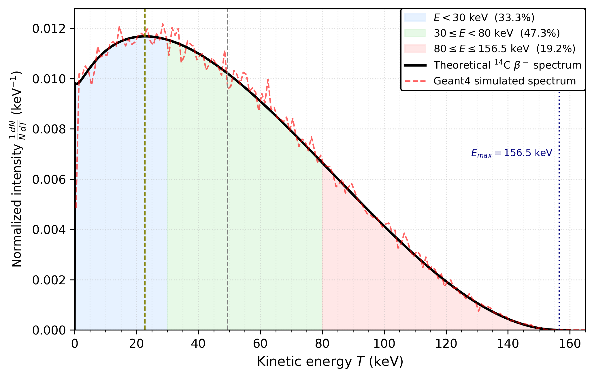
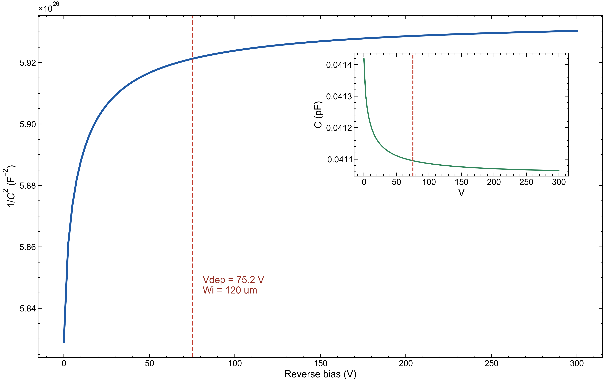
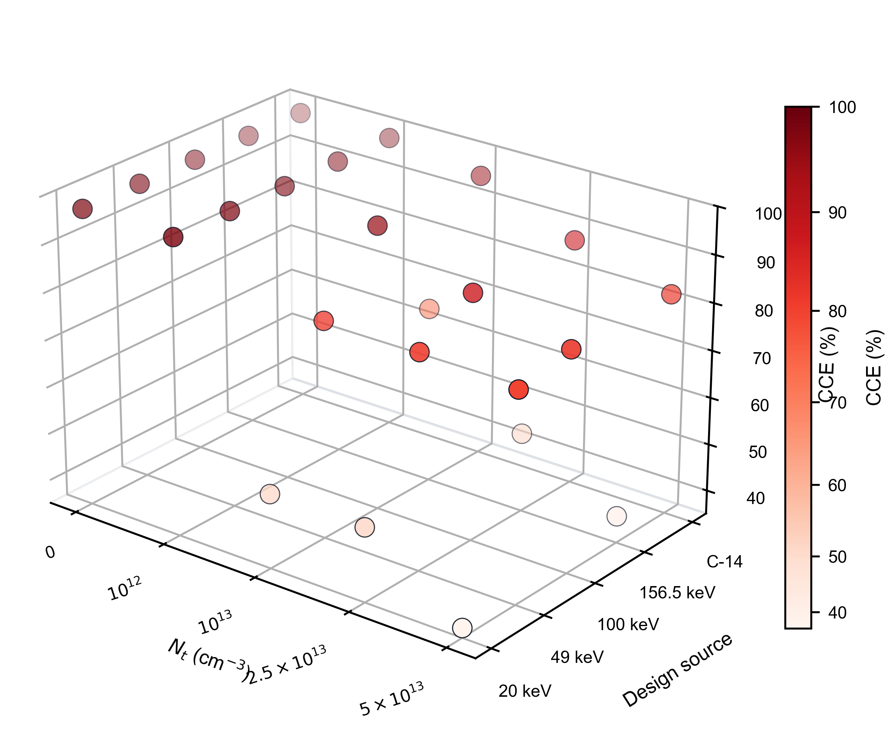

# Geant4-Sentaurus 耦合仿真的 4H-SiC PIN C-14 β 谱探测器设计优化：i 区厚度与外延缺陷密度的权衡

## 摘要

4H-SiC 具有宽禁带、低暗电流和高辐照耐受性，是室温 C-14 β 探测器的重要候选材料。C-14 是低能连续 β 发射源，最大能量为 156.5 keV，平均能量约为 49 keV，其能量沉积深度跨越近表面区域至数十微米量级。现有 SiC 探测器设计通常针对单能电子、MIP 或 α 粒子展开，尚缺少面向 C-14 连续谱、并同时考虑外延层固有缺陷的系统设计研究。本文建立 Geant4-Sentaurus 耦合仿真框架，将 β 粒子在 4H-SiC PIN 结构中的能量沉积映射为 TCAD 瞬态仿真的载流子产生分布，并以电荷收集效率（charge collection efficiency, CCE）作为唯一优化目标。进一步地，本文引入 Z1/2 和 EH6/7 深能级缺陷模型，扫描 i 区厚度与缺陷密度构成的二维设计空间。仿真结果表明，在理想材料中，CCE 随 i 区厚度增加而单调饱和；引入外延层缺陷后，厚器件中的载流子俘获损失显著增强，CCE 转变为非单调函数，最优 i 区厚度随缺陷密度增加向薄端移动。对于 C-14 连续谱，最优厚度从 $N_t=0$ 时的 $150\ \mu\mathrm{m}$ 和 $N_t=10^{12}\ \mathrm{cm^{-3}}$ 时的 $100\ \mu\mathrm{m}$，依次回缩至 $N_t=10^{13}$、$2.5\times10^{13}$ 和 $5\times10^{13}\ \mathrm{cm^{-3}}$ 时的 60、40 和 $30\ \mu\mathrm{m}$。本文进一步比较 20、49、100、156.5 keV 单能源项与 C-14 连续谱的设计差异，说明平均能量单能近似不能可靠替代真实 C-14 谱进行厚度优化。该框架可为不同外延材料质量等级下的 4H-SiC PIN 探测器厚度选择提供参数化设计依据。

**关键词：** 4H-SiC；PIN 探测器；C-14；Geant4；Sentaurus TCAD；电荷收集效率；外延缺陷；

## 1. 引言

### 1.1 研究背景

C-14 监测广泛存在于核设施退役、低放废物表征、生物医学示踪剂和环境本底监测等应用中。传统 C-14 测量常依赖液体闪烁计数器或气流计数器，这类系统通常体积较大、需要试剂或气体处理，并不适合便携式和长期在线监测。固态半导体探测器具有结构紧凑、低维护和易集成等优势，因此可作为低能 β 探测系统的重要发展方向。

4H-SiC 是宽禁带半导体探测器中的代表材料。其禁带宽度约为 3.26 eV，可在室温下保持较低暗电流；高临界击穿电场使器件能够承受较高反偏电压；较高位移阈能和化学稳定性使其适合长期辐照环境。已有工作已经证明 4H-SiC PIN 或 p-n 结探测器可用于 α 粒子、X 射线、MIP 和 β 源响应测量 [1-8]。然而，这些研究多数关注给定器件结构下的探测性能或辐照退化，较少从 C-14 连续谱的空间沉积特征出发系统优化 i 区厚度。

### 1.2 科学问题

C-14 的 β 能谱不是单一能量，而是从近零能量连续分布到 156.5 keV。低能电子主要在近表面区域沉积，而高能尾部可在 SiC 中产生更深的能量沉积。因此，真实 C-14 谱在器件中形成的载流子产生分布不能由某一个单能电子完整代表。尤其在厚度优化问题中，低能部分倾向于选择薄器件以减少不必要的漂移距离，高能尾部则需要足够厚的 i 区以避免沉积截断。

同时，商用 4H-SiC 外延层中不可避免地存在 Z1/2、EH6/7 等深能级缺陷。Z1/2 通常与碳空位相关，是 n 型或轻掺杂 4H-SiC 外延层中最重要的深能级之一。此类缺陷通过 SRH 复合和俘获过程降低载流子收集概率，其影响在厚 i 区器件中更显著。由此产生一个工程设计问题：当外延材料质量有限时，较厚的 i 区虽然有利于吸收 C-14 高能尾部，却也会放大陷阱俘获损失。因此，C-14 探测器的最佳厚度应由 β 能量沉积分布和外延缺陷密度共同决定。

本文围绕以下问题展开：

1. C-14 连续谱在 4H-SiC PIN 中的空间沉积分布与 20、49、100、156.5 keV 单能源项有何差异？
2. 在无缺陷和有缺陷材料中，CCE 如何随 i 区厚度变化？
3. 当缺陷密度 $N_t$ 改变时，使 CCE 最大化的 i 区厚度如何变化？
4. 使用平均能量 49 keV 或最大能量 156.5 keV 的单能近似进行设计，会对真实 C-14 探测 CCE 带来多大偏差？

### 1.3 本文贡献

本文的贡献概括如下。

1. 建立面向 C-14 连续 β 谱的 Geant4-Sentaurus 耦合仿真框架，将 Geant4 能量沉积结果通过二维插值映射为 Sentaurus 可读取的载流子生成率分布。
2. 引入外延层固有 Z1/2 和 EH6/7 深能级缺陷模型，以 $N_t$ 为参数研究材料质量对 CCE 的影响，而不是将问题限定为特定辐照注量。
3. 以 CCE 为唯一品质因子，扫描 i 区厚度与缺陷密度构成的二维设计空间，证明缺陷会使 CCE 从无缺陷情况下的单调饱和函数转变为非单调函数，并导致最优厚度向薄端移动。
4. 给出 20、49、100、156.5 keV 单能源项和 C-14 连续谱的最优厚度随 $N_t$ 变化曲线，量化单能近似相对于真实连续谱的设计偏差。

## 2. 仿真框架

### 2.1 4H-SiC PIN 器件结构

本文研究垂直入射的 4H-SiC PIN 探测器。器件由顶部 $p^+$ 接触层、中间轻掺杂 i 区和底部 $n^+$ 接触层组成，β 电子从 $p^+$ 侧入射。$p^+$ 层厚度为 $0.2\ \mu\mathrm{m}$，$n^+$ 层厚度为 $0.5\ \mu\mathrm{m}$，横向尺寸为 $240\ \mu\mathrm{m}\times240\ \mu\mathrm{m}$。i 区厚度 $W_i$ 作为主要设计变量，在 5、8、10-130、150 和 $180\ \mu\mathrm{m}$ 范围内扫描。i 区净掺杂浓度取 $5.6\times10^{12}\ \mathrm{cm^{-3}}$，$p^+$ 和 $n^+$ 接触区掺杂浓度取 $1\times10^{19}\ \mathrm{cm^{-3}}$。

**Fig.1.** 4H-SiC PIN 探测器结构示意图。图中以 $W_i=120\ \mu\mathrm{m}$ 为参考结构展示，本文实际扫描 $W_i=5$、8、10-130、150 和 $180\ \mu\mathrm{m}$。

**Table 1. 器件结构和材料参数。**

| 参数 | 数值 |
| --- | ---: |
| $p^+$ 厚度 | $0.2\ \mu\mathrm{m}$ |
| i 区厚度 | 5、8、10-130、150、$180\ \mu\mathrm{m}$ |
| $n^+$ 厚度 | $0.5\ \mu\mathrm{m}$ |
| 横向尺寸 | $240\ \mu\mathrm{m}\times240\ \mu\mathrm{m}$ |
| i 区净掺杂 | $5.6\times10^{12}\ \mathrm{cm^{-3}}$ |
| p+ / n+ 掺杂 | $1\times10^{19}\ \mathrm{cm^{-3}}$ |

对于每个 $W_i$，工作偏压取对应全耗尽偏压。耗尽电压的解析估算为

$$
V_{\mathrm{dep}}(W_i)=\frac{qN_DW_i^2}{2\varepsilon_{\mathrm{SiC}}}.
$$

Sentaurus 中的电势、电场和载流子输运由 Poisson 方程和漂移扩散方程自洽求解。全耗尽偏压用于保证不同厚度器件在可比的收集条件下评估 CCE。

### 2.2 Geant4 能量沉积与 TCAD 映射

Geant4 用于模拟 C-14 β 电子和单能电子在 4H-SiC 中的输运与能量沉积。电磁相互作用采用适用于 keV 电子的低能电磁模型。C-14 源项按照理论 β 谱采样，最大能量为 156.5 keV，平均能量约为 49 keV。对照单能源项选择 20、49、100 和 156.5 keV。Geant4 输出的能量沉积先统计为深度分布 $dE/dz$，再转换为二维载流子生成率分布 $G(x,y)$。

**Fig.2.** Geant4-Sentaurus 耦合仿真流程。Geant4 端给出 β 电子在 4H-SiC 中的能量沉积分布，后处理程序将其转换为电子-空穴对生成率并映射至 Sentaurus 网格，最终通过瞬态电流积分得到 CCE。

能量沉积到载流子产生量的转换采用 4H-SiC 平均电子-空穴对产生能量 $E_{eh}=7.8\ \mathrm{eV}$：

$$
N_{eh}=\frac{E_{\mathrm{dep}}}{E_{eh}}.
$$

由于 Geant4 统计网格与 Sentaurus 非均匀器件网格不完全重合，本文采用双线性插值进行空间映射。对任意 Sentaurus 网格点 $(x,y)$，在 Geant4 转换后的二维生成率网格中找到包围该点的四个相邻节点，并按

$$
G(x,y)=(1-t)(1-u)G_{11}+t(1-u)G_{21}+(1-t)uG_{12}+tuG_{22}
$$

计算该点处的生成率。这里 $t=(x-x_1)/(x_2-x_1)$，$u=(y-y_1)/(y_2-y_1)$。

**Fig.2(b).** Sentaurus/TDR 网格中的载流子生成率分布示例。生成率在横向和深度方向均存在明显梯度，说明 Geant4 能量沉积分布已经被映射到 TCAD 器件区域中。

### 2.3 Sentaurus 物理模型

TCAD 仿真求解 Poisson 方程与电子、空穴连续性方程。载流子输运采用漂移扩散模型，并考虑 4H-SiC 各向异性迁移率、掺杂依赖迁移率、高场饱和和不完全电离。复合模型采用 SRH 形式。对有缺陷材料，Z1/2 和 EH6/7 深能级以体缺陷形式加入 i 区。

瞬态仿真输出阴极电流 $i_{\mathrm{cathode}}(t)$。本文不再将瞬态波形宽度作为优化指标，而仅将 $i(t)$ 用于电荷积分和 CCE 计算。

### 2.4 外延层固有缺陷模型

本文关注外延层固有缺陷对器件设计的影响，而不是特定辐照历史下的损伤演化。Z1/2 和 EH6/7 是 n 型或轻掺杂 4H-SiC 外延层中常见的碳空位相关深能级，并被广泛认为会限制少子寿命和电荷收集性能 [16]-[18]。本文采用文献约束的两中心 SRH 体缺陷模型，参数列于 Table 2。$N_t$ 表示每一类缺陷中心在 i 区中的均匀体浓度，即 $N_{\mathrm{Z1/2}}=N_{\mathrm{EH6/7}}=N_t$。

**Table 2. TCAD 仿真采用的 SRH 体陷阱参数。**

| Center | TCAD type | Energy level | $\sigma_e$ (cm$^2$) | $\sigma_h$ (cm$^2$) | Concentration | Main basis |
| --- | --- | --- | ---: | ---: | ---: | --- |
| Z1/2 | Acceptor | $E_c-0.67\ \mathrm{eV}$ | $2\times10^{-14}$ | $1\times10^{-15}$ | $N_t$ | Z1/2 level and acceptor assignment from TCAD/DLTS studies [17], [18]; $\sigma_e$ follows reported TCAD values [17], [19] |
| EH6/7 | Donor | $E_c-1.55\ \mathrm{eV}$ | $2\times10^{-14}$ | $1\times10^{-15}$ | $N_t$ | EH6/7 DLTS energies fall near 1.49-1.63 eV [16]; donor assignment and TCAD use from [17]; capture cross sections chosen within reported TCAD/DLTS order of magnitude [16], [19] |

Z1/2 的能级和电子俘获截面直接采用 Gaggl 等 TCAD 缺陷模型中的取值 [17]。EH6/7 能级取 Kleppinger 等 DLTS 提取范围 1.49-1.63 eV 内的代表值，并接近 Gaggl 等辐照损伤 TCAD 模型采用的 $E_c-1.60\ \mathrm{eV}$ [16], [17]。由于文献报道的俘获截面会随材料、提取方法和校准目标发生明显变化，本文固定 $\sigma_e$ 和 $\sigma_h$，将 $N_t$ 作为受控材料质量参数。等浓度条件 $N_{\mathrm{Z1/2}}=N_{\mathrm{EH6/7}}=N_t$ 是设计空间假设，而不是对某一外延片 DLTS 谱的拟合。

扫描的缺陷密度为

$$
N_t = 0,\ 10^{12},\ 10^{13},\ 2.5\times10^{13},\ 5\times10^{13}\ \mathrm{cm^{-3}}.
$$

其中 $N_t=0$ 作为理想材料基线，$10^{12}\ \mathrm{cm^{-3}}$ 表示低缺陷或高质量外延层情形，$10^{13}\ \mathrm{cm^{-3}}$ 表示缺陷较丰富的外延层情形，$2.5\times10^{13}$ 和 $5\times10^{13}\ \mathrm{cm^{-3}}$ 用于表示更严重的缺陷或等效退化上限情形。由于本文目标是建立厚度选择设计图，而不是反演某一批外延片的真实 DLTS 谱，$N_t$ 应理解为等效体陷阱密度，而非对商业外延材料的绝对分级。

### 2.5 CCE 计算

本文采用 CCE 作为唯一品质因子：

$$
\mathrm{CCE}=\frac{Q_{\mathrm{collected}}}{Q_{\mathrm{generated}}}\times100\%.
$$

其中

$$
Q_{\mathrm{collected}}=\int_0^{T_{\mathrm{int}}}i_{\mathrm{cathode}}(t)\,dt,
$$

而

$$
Q_{\mathrm{generated}}=\frac{E_{\mathrm{dep}}}{E_{eh}}q.
$$

选择 CCE 作为单一目标量的原因是，本文的核心问题是给定外延材料质量后如何选择 i 区厚度以最大化有效收集电荷。缺陷俘获和复合的直接结果是积分收集电荷下降，因此 CCE 比瞬态波形形状更适合作为厚度优化目标。

## 3. 结果

### 3.1 C-14 β 谱和能量沉积分布

Fig.3 给出 C-14 理论 β 谱和 Geant4 采样结果。C-14 β 谱覆盖从近零到 156.5 keV 的连续能量区间，不能由单一能量点完整表示。

**Fig.3.** C-14 β 能谱及 Geant4 采样结果。平均能量约为 49 keV，最大能量为 156.5 keV。

Fig.4 比较了 C-14 连续谱与多个单能源项在 4H-SiC 中的深度能量沉积分布。20 keV 电子主要在近表面区域沉积；49 keV 接近 C-14 平均能量，但只能代表有限深度范围；100 和 156.5 keV 电子具有更深穿透尾部。C-14 连续谱则叠加了浅层沉积和高能尾部，空间分布明显不同于任一单能源项。

**Fig.4.** 不同源项在 4H-SiC 中的深度能量沉积分布。主文后续厚度优化选取 20、49、100、156.5 keV 和 C-14 连续谱作为对照源项。

这一结果说明，若使用平均能量 49 keV 代表 C-14 谱，将低估高能尾部对较厚 i 区的需求；若使用 156.5 keV 代表 C-14 谱，则会过度强调极高能端粒子并可能导致过厚设计。

### 3.2 器件电学表征

在进行 CCE 设计扫描前，需要确认 TCAD 器件模型在基准工作点附近已经进入全耗尽状态。Fig.5 给出 $W_i=120\ \mu\mathrm{m}$ baseline 4H-SiC PIN 器件的 C-V 特性，其中主图采用 $1/C^2$-V 形式，inset 给出原始 C-V 曲线。采用 $1/C^2$-V 是因为该表示方式能够更清楚地展示反偏增大时耗尽层扩展并逐渐进入平台的过程；原始 C-V inset 则用于直观显示电容随反偏升高而下降并接近几何电容。

**Fig.5.** $W_i=120\ \mu\mathrm{m}$ baseline 4H-SiC PIN 器件的 $1/C^2$-V 特性，inset 为原始 C-V 曲线。竖直虚线标出由一维耗尽近似得到的全耗尽电压。

对于本文的 baseline 器件，i 区净掺杂为 $N_D=5.6\times10^{12}\ \mathrm{cm^{-3}}$，厚度为 $W_i=120\ \mu\mathrm{m}$。由

$$
V_{\mathrm{dep}}=\frac{qN_DW_i^2}{2\varepsilon_{\mathrm{SiC}}}
$$

计算得到的全耗尽电压为 75.2 V。Fig.5 中 $1/C^2$ 随反偏升高快速增加，并在该电压之后逐渐趋于高反偏平台；inset 中的 C-V 曲线也显示电容从 $4.14\times10^{-14}$ F 下降并接近 $4.11\times10^{-14}$ F 的几何电容水平。因此，后续以 75 V 作为 $120\ \mu\mathrm{m}$ baseline 器件的瞬态仿真偏压是合理的。

### 3.3 缺陷对 C-14 CCE-厚度关系的影响

Fig.6 给出 C-14 连续谱下 CCE 随 i 区厚度和体缺陷密度 $N_t$ 的变化。完整数据覆盖 5 个源项、17 个厚度和 5 个缺陷密度，共 425 个 TCAD 瞬态响应组合；本节选取其中 C-14 连续谱结果作为主线分析对象。由于 Sentaurus 导出的瞬态曲线在 $t=0$ 附近偶尔包含非物理启动点，本文对所有曲线统一舍去前 6 个采样点，然后用新的前 5 个采样点扣除基线并计算积分电荷。按该规则重新处理后，所有 425 个组合均通过 CCE 物理范围和反向尖峰 QC 检查。

**Fig.6.** C-14 连续谱下 CCE 随 i 区厚度变化的曲线族，参数为陷阱密度 $N_t$。低缺陷密度下 CCE 随厚度增加后趋于饱和；高缺陷密度下厚端俘获损失增强，CCE 变为非单调函数。

理想材料和低缺陷材料中，CCE 从薄端快速上升，并在 $W_i\approx100\ \mu\mathrm{m}$ 后进入接近饱和的区域。$N_t=10^{12}\ \mathrm{cm^{-3}}$ 的曲线几乎与理想材料重合，说明高质量外延层中陷阱俘获不是限制 C-14 电荷收集的主导因素。随着 $N_t$ 增加到 $10^{13}\ \mathrm{cm^{-3}}$，厚器件中的 CCE 开始明显下降，最优厚度回缩到 $60\ \mu\mathrm{m}$；当 $N_t=2.5\times10^{13}$ 和 $5\times10^{13}\ \mathrm{cm^{-3}}$ 时，CCE 分别在 40 和 $30\ \mu\mathrm{m}$ 附近达到最大值，随后随厚度增加而持续降低。

这一现象可以由两个竞争机制解释。薄端 CCE 受限于 C-14 高能尾部的能量沉积覆盖率，增加厚度有利于提高可收集电荷。厚端 CCE 则受限于深处载流子的漂移距离和陷阱俘获概率，增加厚度会放大缺陷引起的收集损失。两种机制竞争后，CCE 从理想材料中的单调饱和函数转变为高缺陷材料中的非单调函数，最优 i 区厚度因此自然出现。

完整数据给出的 C-14 最优设计点如下。

**Table 3. C-14 连续谱下以 CCE 最大化得到的最优设计点。**

| $N_t$ (cm$^{-3}$) | 最优 $W_i$ ($\mu$m) | 偏压 (V) | 最优 CCE (%) | 说明 |
| ---: | ---: | ---: | ---: | --- |
| 0 | 150 | 117 | 97.80 | 理想材料，厚端饱和区内最高点 |
| $10^{12}$ | 100 | 52 | 97.72 | 低缺陷外延层，厚端仍有效 |
| $10^{13}$ | 60 | 19 | 95.09 | 缺陷俘获使最优厚度回缩 |
| $2.5\times10^{13}$ | 40 | 8 | 87.14 | 高缺陷条件下厚端损失显著 |
| $5\times10^{13}$ | 30 | 5 | 81.72 | 严重缺陷条件下薄 i 区更优 |

### 3.4 C-14 CCE 设计地图

Fig.7 将 C-14 连续谱下的 CCE 结果整理为离散设计地图。横轴选取 30、40、60、100 和 $150\ \mu\mathrm{m}$ 五个代表性 i 区厚度，纵轴为陷阱密度 $N_t$，每个格子的颜色和数字表示对应设计点的 CCE，颜色越深表示 CCE 越高。该表示方式可以直接显示高 CCE 设计区域如何随缺陷密度变化而移动。

**Fig.7.** C-14 连续谱下 CCE 关于代表性 i 区厚度和陷阱密度 $N_t$ 的离散设计地图。横向每一列对应一个代表厚度，纵向每一行对应一个缺陷密度，颜色越深表示 CCE 越高；黑框标出该缺陷密度下五个代表厚度中的最高 CCE。

在 $N_t=0$ 和 $10^{12}\ \mathrm{cm^{-3}}$ 时，高 CCE 区域覆盖 100-$150\ \mu\mathrm{m}$ 的厚端代表点，说明低缺陷材料中厚度选择具有较宽容差。随着 $N_t$ 增加到 $10^{13}\ \mathrm{cm^{-3}}$，厚端格子明显变浅，高 CCE 区域集中到 $60\ \mu\mathrm{m}$。进一步增加到 $2.5\times10^{13}$ 和 $5\times10^{13}\ \mathrm{cm^{-3}}$ 后，高 CCE 区域继续向 40 和 $30\ \mu\mathrm{m}$ 回缩，而 $100\ \mu\mathrm{m}$ 以上厚端区域出现显著收集损失。

### 3.5 推广到单能源项的最优厚度

为了比较单能源项与 C-14 连续谱，本文在 20、49、100、156.5 keV 和 C-14 五个源项下分别计算使 CCE 最大化的 i 区厚度。Fig.8 给出最优厚度随 $N_t$ 的变化。

**Fig.8.** 以最大 CCE 为准则得到的最优 i 区厚度随缺陷密度 $N_t$ 的变化。五条曲线分别对应 20、49、100、156.5 keV 和 C-14 连续谱。

低缺陷密度下，多数源项的最优厚度位于 100-$150\ \mu\mathrm{m}$ 的厚端区域，说明当材料质量足够高时，增加 i 区厚度可以更完整地覆盖高能电子的沉积尾部。随着 $N_t$ 增加到 $10^{13}\ \mathrm{cm^{-3}}$，20 和 49 keV 的最优厚度分别回缩到 8 和 $20\ \mu\mathrm{m}$，100 keV 与 C-14 均回缩到 $60\ \mu\mathrm{m}$，而 156.5 keV 仍保持在 $130\ \mu\mathrm{m}$。进一步增大到 $2.5\times10^{13}\ \mathrm{cm^{-3}}$ 后，100 keV 和 C-14 的最优厚度同步回缩到 $40\ \mu\mathrm{m}$；当 $N_t=5\times10^{13}\ \mathrm{cm^{-3}}$ 时，20、49、100 keV 和 C-14 的最优厚度分别为 5、20、30 和 $30\ \mu\mathrm{m}$。156.5 keV 在高缺陷密度下仍偏向厚端，但其可达到的 CCE 已显著降低，说明单纯追求最高能端沉积覆盖会付出较大的俘获损失。

该结果表明，C-14 的最优厚度并不等同于 49 keV 平均能量或 156.5 keV 最高能量的最优厚度。真实连续谱同时包含浅层低能贡献和深层高能尾部，其设计点由谱形和材料缺陷共同决定。

五个源项的统计结果进一步显示，理想材料下最优厚度中位数为 $130\ \mu\mathrm{m}$，最优 CCE 中位数约为 97.8%；$N_t=10^{12}\ \mathrm{cm^{-3}}$ 时，中位最优厚度仍保持在 $120\ \mu\mathrm{m}$。当 $N_t$ 增至 $10^{13}\ \mathrm{cm^{-3}}$ 时，最优厚度中位数回缩至 $60\ \mu\mathrm{m}$，最优 CCE 中位数仍可保持在约 95.1%。当 $N_t=2.5\times10^{13}$ 和 $5\times10^{13}\ \mathrm{cm^{-3}}$ 时，最优厚度中位数进一步回缩至 40 和 $30\ \mu\mathrm{m}$，最优 CCE 中位数分别下降至约 80.5% 和 73.8%。这说明厚度优化能够缓解材料缺陷带来的收集损失，但不能完全抵消高缺陷外延层造成的性能下降。

**Table 4. 五个源项的最优厚度统计。**

| $N_t$ (cm$^{-3}$) | 最优厚度中位数 ($\mu$m) | 最优厚度均值 ($\mu$m) | 相对 $N_t=0$ 的中位回缩 ($\mu$m) | 最优 CCE 中位数 (%) |
| ---: | ---: | ---: | ---: | ---: |
| 0 | 130 | 132 | 0 | 97.80 |
| $10^{12}$ | 120 | 122 | 10 | 97.72 |
| $10^{13}$ | 60 | 55.6 | 70 | 95.09 |
| $2.5\times10^{13}$ | 40 | 57.6 | 90 | 80.54 |
| $5\times10^{13}$ | 30 | 53.0 | 100 | 73.78 |

### 3.6 单能近似造成的设计偏差

为了定量评估用单能电子代替 C-14 连续谱的设计误差，本文固定实际入射源项为 C-14，并比较不同设计源项在各 $N_t$ 下给出的最优厚度用于 C-14 时可达到的 CCE。Fig.9 采用三维散点图表示该交叉评估结果：横轴为缺陷密度 $N_t$，纵轴为设计源项，竖轴和散点颜色均为用于 C-14 时得到的 CCE，颜色越深表示性能越高。

**Fig.9.** 不同单能源项设计用于 C-14 连续谱时的 CCE 三维散点图。每个点对应一个 $N_t$ 与一个设计源项组合，点的高度和颜色表示该设计用于 C-14 时得到的 CCE。

在低缺陷密度下，不同设计源项用于 C-14 时的 CCE 都接近 97.7%-97.8%，说明厚端饱和区掩盖了单能源项之间的差异。随着缺陷密度升高，不同设计源项之间的 CCE 差异被显著放大。对于 $N_t=10^{13}\ \mathrm{cm^{-3}}$，20 keV 设计对应的 C-14 CCE 仅约 50.8%，而 C-14 和 100 keV 设计可达到约 95.1%；156.5 keV 设计约为 72.2%。对于 $N_t=2.5\times10^{13}\ \mathrm{cm^{-3}}$，20 keV 和 156.5 keV 设计用于 C-14 时分别只有约 50.8% 和 51.7%，而 C-14 和 100 keV 设计可达到约 87.1%。对于 $N_t=5\times10^{13}\ \mathrm{cm^{-3}}$，20 keV 与 156.5 keV 设计用于 C-14 时分别只有约 37.1% 和 40.7%，而 C-14 和 100 keV 设计仍可达到约 81.7%。这些结果说明，高缺陷条件下的厚度优化不能简单依赖平均能量或端点能量单能近似。

这说明单能近似是否可接受并不是一个固定结论，而取决于外延层缺陷密度。当材料质量较高时，厚端饱和掩盖了不同源项之间的设计差异；当材料缺陷较高时，谱形差异和陷阱俘获共同放大厚度选择误差。因此，C-14 探测器的厚度优化应直接使用真实连续谱，而不应默认采用平均能量或最大能量单能近似。

## 4. 讨论

### 4.1 CCE 作为唯一优化目标的合理性

本文以 CCE 作为唯一品质因子，是因为目标问题是厚度选择而不是读出电路时间响应优化。对于 C-14 探测，器件几何与材料缺陷首先决定的是有多少由 β 粒子产生的电子-空穴对能够被实际收集。缺陷俘获、深层复合和厚度不足造成的能量沉积截断最终都直接表现为 $Q_{\mathrm{collected}}/Q_{\mathrm{generated}}$ 的下降。因此，CCE 是连接粒子输运、器件结构和材料质量的最直接指标。

瞬态电流波形仍然是 CCE 积分的中间量，但本文不再引入额外的时间类品质因子。这样可以避免多目标权重选择带来的方法学分散，使主线集中于“给定外延材料质量时如何选择 i 区厚度以最大化电荷收集”。

### 4.2 材料质量驱动的设计建议

由 C-14 连续谱结果可得到材料质量驱动的设计速查表。该表不是将某一厚度作为普适最优值，而是说明当外延层可达到的缺陷密度不同时，应如何选择 i 区厚度来最大化 CCE。

**Table 5. C-14 探测应用的材料质量驱动设计建议。**

| 材料质量等级 | $N_t$ (cm$^{-3}$) | 推荐 $W_i$ ($\mu$m) | 偏压 (V) | 预期 CCE (%) |
| --- | ---: | ---: | ---: | ---: |
| Ideal / reference | 0 | 150 | 117 | 97.80 |
| Low-defect epitaxial case | $10^{12}$ | 100 | 52 | 97.72 |
| Defect-rich epitaxial case | $10^{13}$ | 60 | 19 | 95.09 |
| Intermediate severe-defect case | $2.5\times10^{13}$ | 40 | 8 | 87.14 |
| Severe-defect upper-bound case | $5\times10^{13}$ | 30 | 5 | 81.72 |

该表体现了本文的核心工程结论：高质量材料可以使用较厚 i 区以覆盖 C-14 高能尾部；缺陷密度较高时，继续增加厚度会显著放大俘获损失，推荐厚度应向薄端回缩。表中的材料质量描述是等效 TCAD 设计情形，不应理解为对商业外延片的严格产业分级。实际器件设计中，$N_t$ 可由 DLTS、少子寿命或等效 TCAD 校准获得，随后从该设计图中读取推荐厚度范围。

### 4.3 与已有文献的间接验证

本文结论可与已有 4H-SiC 探测器和外延层质量研究进行间接对照。Moscatelli 等对 SiC $p^+/n$ 结探测器的 CCE 测量与仿真表明，合适的 TCAD 模型能够再现实验电荷收集趋势 [6]。Kleppinger 等对 50、150 和 $250\ \mu\mathrm{m}$ 4H-SiC 外延层的研究显示，厚外延层的缺陷和材料质量会显著影响探测器性能；这与本文关于“厚器件对缺陷更敏感”的趋势一致。Kimoto 与 Capan 等对 SiC 外延生长和电活性缺陷的综述也支持本文将 Z1/2 作为外延层主要电活性缺陷纳入模型 [15], [18]。

此外，4H-SiC betavoltaic 优化工作通常也面对类似的厚度-材料质量权衡：较厚吸收层可提高 β 能量吸收，但会引入更强的复合损失。本文的 CCE-厚度-$N_t$ 设计图与这类优化问题具有共同物理基础。

### 4.4 模型局限

本文仍存在若干局限。第一，载流子输运采用漂移-扩散近似，尚未包含全 Monte Carlo 载流子输运。第二，表面复合、边缘场和封装窗口材料被简化处理，这可能影响 20 keV 等低能电子的近表面响应。第三，缺陷模型仅包含 Z1/2 和 EH6/7 两类主导中心，未纳入所有可能的次要深能级。第四，本文只讨论室温条件，温度对迁移率、寿命和陷阱俘获动力学的影响需要后续研究。第五，瞬态曲线的前 6 个采样点被统一视为数值启动区并从积分中剔除；该处理降低了 TCAD 启动瞬态对 CCE 的影响，但更严格的时间步长、初始条件和收敛设置仍需在后续工作中进一步确认。

## 5. 结论

本文建立了面向 C-14 连续 β 谱的 Geant4-Sentaurus 耦合仿真框架，并将其用于 4H-SiC PIN 探测器 i 区厚度和外延缺陷密度的二维设计优化。

第一，Geant4 结果表明，C-14 连续谱在 SiC 中形成的能量沉积分布同时包含浅层低能贡献和高能深层尾部，不能由 49 keV 平均能量或 156.5 keV 最大能量的单能源项完整替代。

第二，以 CCE 为唯一优化目标时，理想材料中 CCE 随 i 区厚度增加而趋于饱和；引入 Z1/2 和 EH6/7 深能级缺陷后，厚端载流子俘获损失增强，CCE 转变为非单调函数，最优 i 区厚度自然出现。

第三，C-14 连续谱的最优厚度随材料缺陷密度系统性变化。完整数据表明，C-14 最优厚度从 $N_t=0$ 时的 $150\ \mu\mathrm{m}$ 和 $N_t=10^{12}\ \mathrm{cm^{-3}}$ 时的 $100\ \mu\mathrm{m}$，回缩到 $N_t=10^{13}$、$2.5\times10^{13}$ 和 $5\times10^{13}\ \mathrm{cm^{-3}}$ 下的 60、40 和 $30\ \mu\mathrm{m}$。对应最优 CCE 分别约为 97.8%、97.7%、95.1%、87.1% 和 81.7%。

第四，单能近似造成的厚度设计误差会随缺陷密度增大而放大。在低缺陷材料中，不同源项的最优厚度均处于厚端饱和区，用于 C-14 的交叉 CCE 损失通常低于 0.1 个百分点；在高缺陷材料中，使用 20 keV 或 156.5 keV 代替 C-14 进行设计可造成 35-45 个百分点量级的 CCE 损失。因此，C-14 探测器的厚度优化应直接使用真实连续谱。

综上，本文给出了一种基于外延材料质量等级的 4H-SiC PIN C-14 探测器厚度选择方法。该方法可进一步推广到 Ni-63、H-3 等其他低能 β 源，以及 betavoltaic 电池中吸收层厚度与材料质量的协同优化。

## 参考文献

[1] T. Kimoto and J. A. Cooper, *Fundamentals of Silicon Carbide Technology*, Wiley, 2014.

[2] F. Nava, G. Bertuccio, A. Cavallini, and E. Vittone, "Silicon carbide and its use as a radiation detector material," *Measurement Science and Technology*, vol. 19, 102001, 2008.

[3] M. De Napoli, "SiC detectors: A review on the use of silicon carbide as radiation detection material," *Frontiers in Physics*, vol. 10, 898833, 2022.

[4] M. V. Dolgopolov and A. S. Chipura, "Heterojunction betavoltaic Si14C-Si energy converter," *Journal of Power Sources*, vol. 610, 234896, 2024.

[5] A. V. Gurskaya, A. A. Ivanov, A. V. Kiselev, and A. A. Solodovnikov, "SiC/Si-based converter of C-14 beta decay energy," *Physics of Particles and Nuclei*, vol. 48, pp. 941-944, 2017.

[6] F. Moscatelli et al., "Measurements and simulations of charge collection efficiency of p+/n junction SiC detectors," *Nuclear Instruments and Methods in Physics Research A*, vol. 546, pp. 218-221, 2005.

[7] J. He et al., "Transient behaviour analysis in silicon carbide alpha particle detector using TCAD and SRIM simulation," *Physica Scripta*, vol. 99, 075943, 2024.

[8] A. Gsponer et al., "Extraction of electron and hole drift velocities in thin 4H-SiC PIN detectors using high-frequency readout electronics," *Sensors*, vol. 25, 7196, 2025.

[9] S. Agostinelli et al., "Geant4: A simulation toolkit," *Nuclear Instruments and Methods in Physics Research A*, 2003.

[10] J. Allison et al., "Recent developments in Geant4," *Nuclear Instruments and Methods in Physics Research A*, 2016.

[11] A. Gsponer et al., "Measurement of the electron-hole pair creation energy in a 4H-SiC p-n diode," *Nuclear Instruments and Methods in Physics Research A*, vol. 1064, 169412, 2024.

[12] Synopsys, *Sentaurus Device User Guide*, Synopsys Inc.

[13] NIST, "ESTAR: Stopping-power and range tables for electrons," National Institute of Standards and Technology.

[14] M. Batic et al., "Validation of Geant4 simulation of electron energy deposition," *IEEE Transactions on Nuclear Science*, vol. 60, pp. 2934-2941, 2013.

[15] T. Kimoto, "Bulk and epitaxial growth of silicon carbide," *Progress in Crystal Growth and Characterization of Materials*, 2016.

[16] K. Kleppinger et al., "Carrier trapping in 4H-SiC epitaxial layers with different thicknesses," *Journal of Crystal Growth*, 2022.

[17] P. Gaggl et al., "TCAD modeling of radiation-induced defects in 4H-SiC diodes," *Nuclear Instruments and Methods in Physics Research A*, vol. 1070, 170015, 2025.

[18] I. Capan, "Electrically active defects in 3C, 4H, and 6H silicon carbide polytypes: A review," *Crystals*, vol. 15, 255, 2025.

[19] K. M. Kim, I. M. Kang, J. H. Seo, Y. J. Yoon, and K. Kim, "Structural optimization and trap effects on the output performance of 4H-SiC betavoltaic cell," *Nanomaterials*, vol. 15, 1625, 2025.
