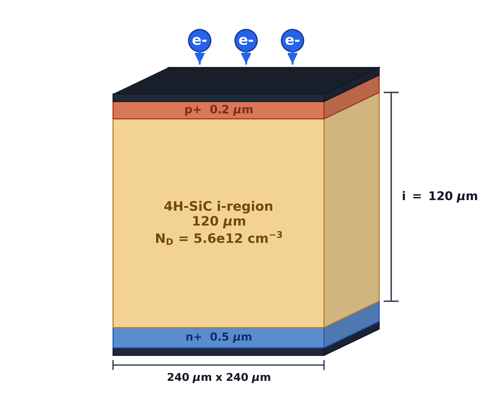
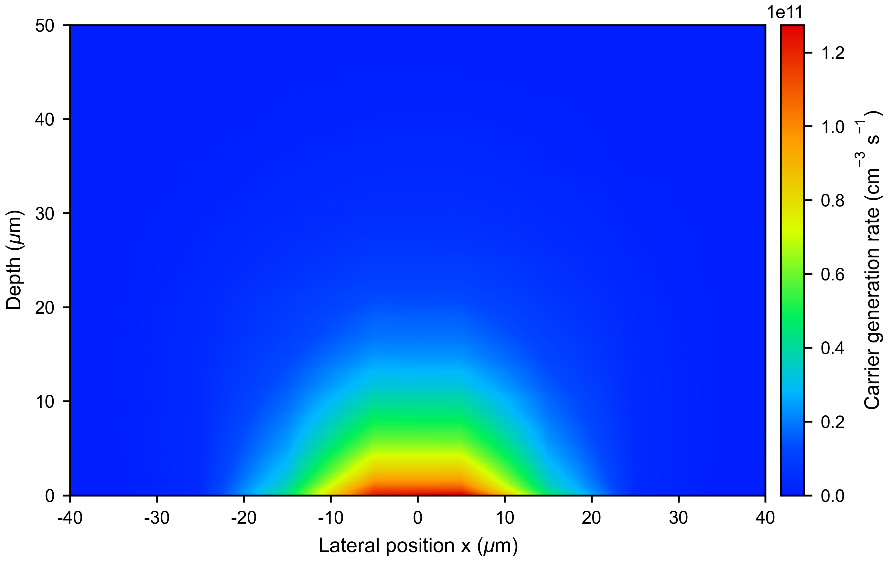
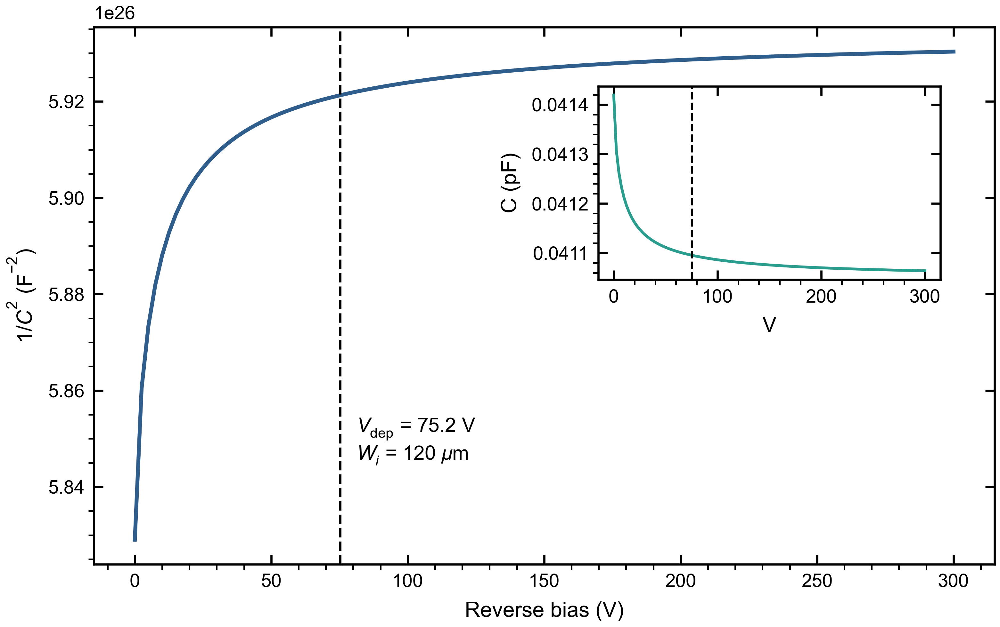
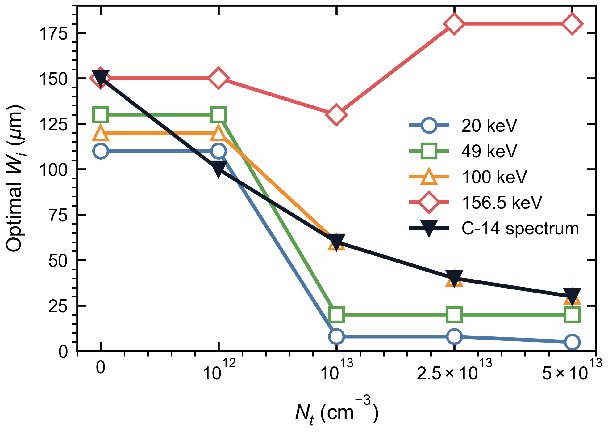
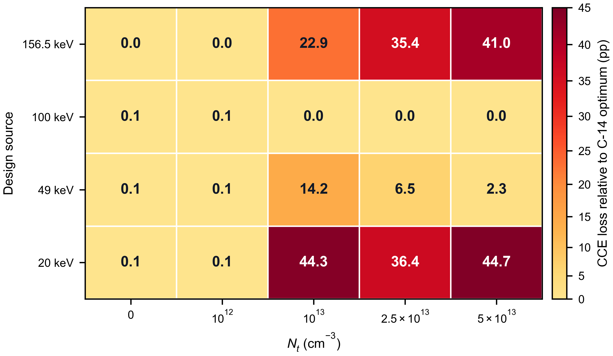

# Thickness Optimization of 4H-SiC PIN ¹⁴C Beta Detectors under Continuous Beta-Spectrum Deposition and Epitaxial Trap Constraints

**Author information:** [Author names, affiliations, and corresponding author information to be inserted before submission]

## Abstract

4H-SiC combines a wide bandgap, low dark current, and high radiation tolerance, making it attractive for room-temperature low-energy beta detection. This work investigates how the continuous ¹⁴C beta spectrum and deep-level defects in the epitaxial layer jointly determine the intrinsic-layer thickness of a 4H-SiC PIN detector. Energy-deposition profiles calculated with Geant4 are mapped into transient carrier-generation terms in TCAD, and the detector response is evaluated using a source-normalized effective charge collection efficiency (eCCE). The model includes the Z₁/₂ and EH₆/₇ bulk traps and compares devices over Wᵢ=5-180 µm and Nₜ=0 to 5×10¹³ cm⁻³. In ideal or low-defect epitaxial layers, eCCE increases with intrinsic-layer thickness and then approaches saturation. As the trap density increases, carrier trapping in thick devices makes eCCE a non-monotonic function of thickness. For the continuous ¹⁴C spectrum, the optimum thickness shifts from 150 µm to 30 µm, while the optimum eCCE decreases from 97.80% to 81.72%. Cross-evaluation with monoenergetic sources shows that average-energy or endpoint-energy approximations can lead to significant thickness-selection errors under defective-material conditions. Therefore, 4H-SiC ¹⁴C detector design should consider both the realistic beta spectrum and the epitaxial material quality, rather than relying only on monoenergetic electron ranges.

**Keywords:** 4H-SiC; PIN detector; ¹⁴C; Geant4; TCAD; effective charge collection efficiency; epitaxial defects

## Highlights

- A Geant4-TCAD workflow is developed for 4H-SiC ¹⁴C beta detectors.
- Continuous beta spectra change the optimal intrinsic-layer thickness.
- Deep traps make eCCE non-monotonic with intrinsic-layer thickness.
- The optimal thickness shifts from 150 to 30 µm as trap density rises.
- Single-energy designs can mislead thickness selection in defective epilayers.

## 1. Introduction

### 1.1. Background

Monitoring of ¹⁴C is relevant to nuclear-facility decommissioning, low-level radioactive-waste characterization, biomedical tracer studies, and environmental background surveillance. Liquid scintillation counters and gas-flow counters provide mature metrological capability, but they usually require bulky auxiliary systems and reagent or gas-handling procedures. For portable and long-term online monitoring, solid-state semiconductor detectors are attractive because of their compact structure, low maintenance requirements, and compatibility with integrated electronic systems.

4H-SiC is a representative wide-bandgap material for low-energy radiation detectors. Its bandgap of approximately 3.26 eV supports low-dark-current operation at room temperature. Its high critical electric field enables relatively thick depleted regions under reverse bias, while its high displacement threshold energy and chemical stability are favorable for long-term irradiation environments. Previous studies have demonstrated that 4H-SiC PIN or p-n junction devices can detect alpha particles, X-rays, minimum-ionizing particles, and beta sources [1-8]. However, the thickness design of a ¹⁴C detector remains nontrivial because the continuous beta spectrum determines the depth distribution of deposited energy, whereas deep-level defects in the epitaxial layer modify the probability that the deposited charge is actually collected.

### 1.2. Coupling between beta-spectrum shape and epitaxial defects

The ¹⁴C beta spectrum is continuous from nearly zero energy to an endpoint energy of 156.5 keV. Low-energy electrons deposit most of their energy near the entrance surface, whereas the high-energy tail can produce deeper energy deposition in SiC. Therefore, the carrier-generation profile produced by a realistic ¹⁴C source cannot be fully represented by any single monoenergetic electron. In a PIN detector, increasing the intrinsic-layer thickness helps to cover the high-energy tail, but it also increases the carrier drift distance and collection time.

Epitaxial defects further strengthen this trade-off. The Z₁/₂ and EH₆/₇ deep levels commonly observed in 4H-SiC epitaxial layers can reduce the charge collection efficiency through Shockley-Read-Hall (SRH) recombination and carrier trapping, with stronger impact in thick intrinsic layers. The optimum thickness of a ¹⁴C detector should therefore be determined not only by electron range, but also by the coupled effects of continuous-spectrum deposition, epitaxial trap density, and device electric field. This problem is essentially the definition of a practically attainable device-design window under non-ideal material conditions.

### 1.3. Scope of this work

This work combines Geant4 low-energy electron transport with TCAD transient device simulation to optimize the intrinsic-layer thickness of 4H-SiC PIN ¹⁴C beta detectors. Geant4 is used to obtain energy-deposition profiles for the continuous ¹⁴C beta spectrum and for $20$, $49$, $100$, and 156.5 keV monoenergetic electron sources. These profiles are then converted into carrier-generation distributions for TCAD. The TCAD model uses drift-diffusion transport and SRH recombination, and the epitaxial material quality is represented by the Z₁/₂ and EH₆/₇ bulk traps.

Compared with previous SiC detector simulations, this work focuses on the coupled relationship among the ¹⁴C continuous spectrum, intrinsic-layer thickness, and epitaxial trap density. Moscatelli et al. mainly studied the experimental-simulation comparison of CCE in SiC junction detectors [6]. He et al. analyzed the transient response of alpha-particle SiC detectors [7]. Kim et al. discussed structural optimization and trap effects in 4H-SiC betavoltaic devices [18]. The present study addresses ¹⁴C beta detection and provides a CCE-thickness-Nₜ design map, together with a quantitative assessment of the thickness-selection error caused by replacing the realistic continuous spectrum with a monoenergetic source.

## 2. Model and simulation method

### 2.1. 4H-SiC PIN detector structure

A vertically irradiated 4H-SiC PIN detector is considered. The device consists of a top p+ entrance layer, a lightly doped intrinsic region, and a bottom n+ contact layer. Beta electrons enter from the p+ side. The p+ layer thickness is 0.2 µm, the n+ layer thickness is 0.5 µm, and the lateral size is 240 µm×240 µm. The intrinsic-layer thickness Wᵢ is the main design variable and is swept from $5$ to 180 µm. The net doping concentration of the intrinsic layer is 5.6×10¹² cm⁻³, and the doping concentration of the p+ and n+ regions is 1×10¹⁹ cm⁻³.

{width=3.5in}

**Fig. 1.** Schematic structure of the 4H-SiC PIN detector. A reference structure with Wᵢ=120 µm is shown. In the simulations, Wᵢ is swept over $5$, $8$, $10$-$130$, $150$, and 180 µm.

**Table 1. Device structure and material parameters.**

| Parameter | Value |
| --- | ---: |
| p+ layer thickness | 0.2 µm |
| Intrinsic-layer thickness | $5$, $8$, $10$-$130$, $150$, and 180 µm |
| n+ layer thickness | 0.5 µm |
| Lateral size | 240 µm×240 µm |
| Intrinsic-layer net doping | 5.6×10¹² cm⁻³ |
| p+ / n+ doping | 1×10¹⁹ cm⁻³ |

For each Wᵢ, the operating bias is set to the corresponding full-depletion voltage. The analytical estimate of the depletion voltage is

$$
V_{\mathrm{dep}}(W_i)=\frac{qN_DW_i^2}{2\varepsilon_{\mathrm{SiC}}}.
$$

The electrostatic potential, electric field, and carrier transport are solved self-consistently in TCAD using the Poisson equation and the drift-diffusion equations. All thickness cases are evaluated under their corresponding full-depletion bias so that the comparison is performed under consistent depletion conditions.

### 2.2. Geant4 energy deposition and TCAD carrier-generation term

Geant4 is used to calculate the transport and energy deposition of ¹⁴C beta electrons and monoenergetic electrons in 4H-SiC. The ¹⁴C source is sampled from the allowed beta-decay spectrum, with an endpoint energy of 156.5 keV and an average energy of approximately 49 keV. The comparison sources are $20$, $49$, $100$, and 156.5 keV monoenergetic electrons. The theoretical spectrum can be written as

$$
\frac{dN}{dT}\propto F(Z,T)\,p\,(T+m_ec^2)(E_0-T)^2,
$$

where $T$ is the electron kinetic energy, $p$ is the electron momentum, E_0=156.5 keV is the endpoint energy, and $F(Z,T)$ is the Fermi-function correction. Geant4 records the step-wise energy deposition in SiC and normalizes it per incident particle. The resulting spatial distribution is then converted into a two-dimensional carrier-generation rate G(x,y) for the TCAD transient simulation.

{width=6.0in}

**Fig. 2.** Geant4-TCAD coupling workflow. Geant4 calculates the beta-electron energy-deposition distribution in 4H-SiC, which is converted into electron-hole pair generation and applied as a transient source term in TCAD. The final CCE is obtained by integrating the transient current. GPS denotes the Geant4 General Particle Source.

The conversion from deposited energy to generated electron-hole pairs uses the average electron-hole pair creation energy of 4H-SiC, Eₑₕ=7.8 eV:

$$
N_{eh}=\frac{E_{\mathrm{dep}}}{E_{eh}}.
$$

The Geant4 energy deposition Edep is binned in depth and lateral position and interpolated onto the TCAD mesh to form G(x,y,t). The same temporal pulse is used for different sources and thicknesses. Because keV electrons undergo appreciable scattering in SiC, the two-dimensional deposition profile is retained instead of being laterally averaged. Fig. 3 shows a typical generation-rate distribution used in TCAD.

{width=4.2in}

**Fig. 3.** Typical carrier-generation-rate distribution used in TCAD, in $\mathrm{cm^{-3}\ s^{-1}}$. The generation rate has clear lateral and depth gradients, reflecting the non-uniform deposition of low-energy beta electrons in 4H-SiC.

To evaluate whether the Geant4-to-TCAD mapping introduces additional normalization error, the number of electron-hole pairs derived from the Geant4 deposited energy is compared with the integral of the TCAD generation rate. The Geant4-based number of pairs is

$$
N_{eh}^{\mathrm{Geant4}}=\frac{\langle E_{\mathrm{dep}}\rangle}{E_{eh}},
$$

and the mapped TCAD source integral is

$$
N_{eh}^{\mathrm{TCAD}}=\int G\,dV\,dt.
$$

The comparison is given in Table 2. The two values agree within numerical precision, confirming that the normalization charge used in the subsequent CCE calculation is consistent with the Geant4 deposited energy.

**Table 2. Normalization consistency between Geant4 energy deposition and the TCAD generation-rate integral.**

| Source | $N_{eh}^{\mathrm{Geant4}}$ | $N_{eh}^{\mathrm{TCAD}}$ | Relative error (%) |
| :-: | --: | --: | --: |
| 20 keV | $2.353\times10^3$ | $2.353\times10^3$ | $-1.93\times10^{-14}$ |
| 49 keV | $5.805\times10^3$ | $5.805\times10^3$ | $3.13\times10^{-14}$ |
| 100 keV | $1.191\times10^4$ | $1.191\times10^4$ | $0$ |
| 156.5 keV | $1.875\times10^4$ | $1.875\times10^4$ | $-1.94\times10^{-14}$ |
| ¹⁴C spectrum | $5.919\times10^3$ | $5.919\times10^3$ | $0$ |

### 2.3. TCAD physical model

The TCAD simulation solves the Poisson equation and the electron and hole continuity equations:

$$
\nabla\cdot(\varepsilon\nabla\psi)=-q(p-n+N_D⁺-N_A⁻),
$$

$$
\frac{\partial n}{\partial t}=\frac{1}{q}\nabla\cdot J_n+G-R,\qquad
\frac{\partial p}{\partial t}=-\frac{1}{q}\nabla\cdot J_p+G-R.
$$

The carrier currents are described by the drift-diffusion form:

$$
J_n=q\mu_n nE+qD_n\nabla n,\qquad
J_p=q\mu_p pE-qD_p\nabla p.
$$

The model includes anisotropic mobility in 4H-SiC, doping-dependent mobility, high-field velocity saturation, and incomplete ionization. Recombination is described by the SRH model. In defective material cases, the Z₁/₂ and EH₆/₇ deep levels are introduced as uniform bulk traps in the intrinsic region. All thickness scans use the same material parameters and boundary conditions; the only differences are the intrinsic-layer thickness, full-depletion bias, source spatial distribution, and trap concentration.

### 2.4. Epitaxial deep-level defect model

A literature-constrained two-center SRH bulk-defect model is used to describe the epitaxial material quality. The Z₁/₂ and EH₆/₇ levels are carbon-vacancy-related deep centers commonly observed in n-type or lightly doped 4H-SiC epitaxial layers, and they are known to limit minority-carrier lifetime and charge collection performance [14-17]. The model parameters are summarized in Table 3. Here, Nₜ denotes the uniform bulk concentration of each defect center in the intrinsic layer, that is, $N_{Z_{1/2}}=N_{\mathrm{EH}_{6/7}}=N_t$.

**Table 3. SRH bulk-trap parameters used in the TCAD simulations.**

| Center | Type | Level | $\sigma_e$ (cm²) | $\sigma_h$ (cm²) | Conc. | Refs. |
| :-: | :-: | :-: | :--: | :--: | :--: | :-: |
| Z₁/₂ | Acceptor | E_c-0.67 eV | $2\times10^{-14}$ | $1\times10^{-15}$ | Nₜ | [16,17] |
| EH₆/₇ | Donor | E_c-1.55 eV | $2\times10^{-14}$ | $1\times10^{-15}$ | Nₜ | [15,16] |

The energy level and electron capture cross section of Z₁/₂ follow the TCAD defect model reported by Gaggl et al. [16]. The EH₆/₇ level is taken as a representative value within the DLTS-extracted range reported by Kleppinger et al. and is close to the E_c-1.60 eV value used by Gaggl et al. [15,16]. Because reported capture cross sections depend on material, extraction method, and calibration target, $\sigma_e$ and $\sigma_h$ are fixed in this work, while Nₜ is treated as an equivalent epitaxial material-quality parameter.

Under the low-injection approximation, the trap-limited capture time can be roughly expressed as

$$
\tau_{n,p}^{\mathrm{trap}}\approx \frac{1}{v_{\mathrm{th}}\sigma_{n,p}N_t},
$$

where $v_{\mathrm{th}}$ is the thermal velocity. This expression indicates that increasing Nₜ or the capture cross section shortens the effective lifetime and thus enhances the charge loss associated with long drift paths in thick intrinsic layers.

The trap density is swept over

$$
N_t = 0,\ 10^{12},\ 10^{13},\ 2.5\times10^{13},\ 5\times10^{13}\ \mathrm{cm^{-3}}.
$$

The case Nₜ=0 is used as an ideal-material reference, whereas the other cases represent equivalent epitaxial material conditions ranging from low-defect to strongly trap-limited regimes.

### 2.5. Effective charge collection efficiency

The CCE reported in this work is a source-normalized effective CCE rather than the conventional fraction of already-generated carriers collected by the electrodes. It combines finite-thickness deposition coverage and transport/trapping loss inside the device into a single metric, allowing the collected charge yield of different intrinsic-layer thicknesses to be compared for the same source.

The collected charge is calculated from the transient cathode current as

$$
Q_{\mathrm{col}}=\left|\int_0^{T_{\mathrm{int}}}i_{\mathrm{cathode}}(t)\,dt\right|.
$$

Using the reference deposited energy $E_{\mathrm{dep}}^{\mathrm{ref}}(s)$ for the same source $s$ as the normalization basis, the effective CCE is defined as

$$
\mathrm{eCCE}(W_i,N_t,s)=
\frac{Q_{\mathrm{col}}}{qE_{\mathrm{dep}}^{\mathrm{ref}}(s)/E_{eh}}.
$$

Here, Eₑₕ is the energy required to create one electron-hole pair in 4H-SiC, and Tint is the integration window covering the main transient collection process. This dimensionless quantity is reported as a percentage in the figures and tables.

Thus, the term CCE in the figures and subsequent discussion refers to eCCE unless otherwise noted. It can be interpreted as the combined effect of the finite-thickness deposition fraction ηdep and the collection fraction of generated charge ηcol, but it is not equivalent to the total experimental detection efficiency. Source activity, geometrical solid angle, packaging windows, surface contamination layers, readout threshold, and system-level efficiency are outside the scope of this thickness-optimization metric.

## 3. Results and discussion

### 3.1. ¹⁴C beta spectrum and energy-deposition distribution

Fig. 4 shows the theoretical ¹⁴C beta spectrum and the Geant4-sampled spectrum. The ¹⁴C beta spectrum spans a continuous kinetic-energy range from nearly zero to 156.5 keV.

{width=4.2in}

**Fig. 4.** ¹⁴C beta spectrum and Geant4 sampling result. The average energy is approximately 49 keV, and the endpoint energy is 156.5 keV.

Fig. 5 compares the depth-dependent energy-deposition profiles in 4H-SiC for the continuous ¹⁴C spectrum and several monoenergetic sources. Low-energy electrons deposit energy mainly near the entrance surface, whereas higher-energy electrons exhibit a deeper penetration tail. The ¹⁴C spectrum contains both shallow low-energy contributions and a high-energy tail, and therefore cannot be fully represented by a single monoenergetic source.

{width=5.8in}

**Fig. 5.** Depth-dependent energy-deposition profiles for different sources in 4H-SiC. The $10$ and 30 keV curves are included to illustrate the low-energy deposition trend. The subsequent thickness optimization uses $20$, $49$, $100$, and 156.5 keV monoenergetic sources and the continuous ¹⁴C spectrum.

To check the depth scale of the Geant4 low-energy electron transport, the one-dimensional Geant4 depth-deposition distribution is compared with the NIST ESTAR benchmark [13]. The quantities z₅₀ and z₉₀ denote the projected depths at which the cumulative deposited energy reaches 50% and 90%, respectively. The ESTAR continuous-slowing-down approximation range RCSDA is converted from mass thickness to length using the density of SiC.

**Table 4. Comparison between the one-dimensional Geant4 depth-deposition distribution and the ESTAR electron-range benchmark.**

| Energy | ESTAR RCSDA (µm) | Geant4 z₅₀ (µm) | Geant4 z₉₀ (µm) | Edep/Ein |
| :-: | --: | --: | --: | --: |
| 20 keV | 3.44 | 0.98 | 1.95 | 0.918 |
| 49 keV | 16.35 | 4.93 | 9.56 | 0.924 |
| 100 keV | 55.36 | 16.87 | 32.61 | 0.929 |
| 156.5 keV | 115.94 | 35.09 | 67.23 | 0.934 |

The four energy points show consistent order of magnitude and monotonic trends, indicating that the penetration depth obtained from Geant4 is compatible with the ESTAR reference.

### 3.2. Electrical characterization of the baseline device

Before performing the CCE thickness scan, the baseline device is checked to confirm that it reaches full depletion at the applied bias. Fig. 6 shows the $1/C^2$-$V$ and $C$-$V$ characteristics of the Wᵢ=120 µm device.

{width=4.2in}

**Fig. 6.** $1/C^2$-$V$ characteristic of the baseline 4H-SiC PIN device with Wᵢ=120 µm. The inset shows the original $C$-$V$ curve. The vertical dashed line marks the full-depletion voltage estimated from the one-dimensional depletion approximation.

In Fig. 6, $1/C^2$ reaches a plateau after approximately 75 V. The capacitance in the inset also approaches the geometrical-capacitance level of $4.11\times10^{-14}\ \mathrm{F}$, which agrees with the value of $4.12\times10^{-14}\ \mathrm{F}$ estimated from $C_{\mathrm{geo}}=\varepsilon_{\mathrm{SiC}}A/W_i$. Therefore, 75 V can be used as the full-depletion operating bias for the 120 µm baseline device.

### 3.3. Effect of defects on the ¹⁴C CCE-thickness relationship

Fig. 7 shows the effective CCE under the continuous ¹⁴C spectrum as a function of intrinsic-layer thickness and bulk trap density Nₜ.

{width=4.3in}

**Fig. 7.** CCE versus intrinsic-layer thickness under the continuous ¹⁴C spectrum for different trap densities Nₜ. In the ideal model, CCE increases with thickness and then saturates. At high trap densities, trapping loss in thick devices makes CCE a non-monotonic function of thickness.

In ideal and low-defect materials, CCE increases rapidly from the thin side and becomes nearly saturated after Wᵢ≈100 µm. As Nₜ increases, carriers generated in thicker devices experience longer drift paths and more pronounced trapping loss, causing CCE to change from a monotonic saturation curve to a non-monotonic curve. The optimum thickness for the ¹⁴C spectrum consequently moves from the thick-end plateau to 60, 40, and 30 µm.

The representative ¹⁴C design points obtained by maximizing CCE are listed in Table 5.

**Table 5. Optimum design points for the continuous ¹⁴C spectrum based on maximum CCE.**

| Nₜ (cm⁻³) | Optimum Wᵢ (µm) | Bias (V) | Optimum CCE (%) |
| :--: | :--: | :--: | :--: |
| 0 | 150 | 117 | 97.80 |
| $10^{12}$ | 100 | 52 | 97.72 |
| $10^{13}$ | 60 | 19 | 95.09 |
| 2.5×10¹³ | 40 | 8 | 87.14 |
| $5\times10^{13}$ | 30 | 5 | 81.72 |

Fig. 8 summarizes the CCE results under the continuous ¹⁴C spectrum as a design map, showing that the high-CCE region shifts toward thinner intrinsic layers as the defect density increases.

{width=4.3in}

**Fig. 8.** Discrete CCE design map for representative intrinsic-layer thicknesses and trap densities under the continuous ¹⁴C spectrum. Each column corresponds to a representative thickness, and each row corresponds to a defect density. Deeper color indicates higher CCE.

### 3.4. Optimum thickness for different source terms

To compare monoenergetic sources with the continuous ¹⁴C spectrum, the intrinsic-layer thickness that maximizes CCE is calculated for five source terms: $20$, $49$, $100$, and 156.5 keV monoenergetic electrons and the continuous ¹⁴C spectrum. Fig. 9 shows the optimum thickness as a function of Nₜ.

{width=4.3in}

**Fig. 9.** Optimum intrinsic-layer thickness versus trap density Nₜ, using maximum CCE as the optimization criterion. The five curves correspond to $20$, $49$, $100$, and 156.5 keV monoenergetic electrons and the continuous ¹⁴C spectrum.

Fig. 9 shows that the optimum thickness depends strongly on the source term. At low defect density, most sources favor the thick-end plateau. As the defect density increases, low-energy monoenergetic sources rapidly shift toward thin layers, whereas the 156.5 keV endpoint source still favors thick layers even though its attainable CCE is markedly reduced. The 100 keV source and the continuous ¹⁴C spectrum produce the same optimum thickness in part of the defect-density range. This coincidence is specific to the present parameter set and thickness grid and should not be interpreted as a general rule for replacing a continuous spectrum by a fixed monoenergetic source. The optimum points for all source terms are listed in Table 6.

**Table 6. Optimum points for different source terms and trap densities. Each entry is given as optimum Wᵢ (µm) / optimum CCE (%).**

| Nₜ (cm⁻³) | 20 keV | 49 keV | 100 keV | 156.5 keV | ¹⁴C |
| :--: | :--: | :--: | :--: | :--: | :--: |
| 0 | 110 / 74.24 | 130 / 97.74 | 120 / 99.41 | 150 / 99.62 | 150 / 97.80 |
| $10^{12}$ | 110 / 74.19 | 130 / 97.67 | 120 / 99.35 | 150 / 99.56 | 100 / 97.72 |
| $10^{13}$ | 8 / 73.88 | 20 / 97.48 | 60 / 97.39 | 130 / 72.37 | 60 / 95.09 |
| 2.5×10¹³ | 8 / 73.82 | 20 / 97.21 | 40 / 80.54 | 180 / 52.03 | 40 / 87.14 |
| $5\times10^{13}$ | 5 / 73.78 | 20 / 96.59 | 30 / 66.87 | 180 / 37.69 | 30 / 81.72 |

### 3.5. Design bias caused by monoenergetic approximations

To quantify the design error caused by replacing the continuous ¹⁴C spectrum with a monoenergetic electron source, the actual incident source is fixed as ¹⁴C, and the CCE obtained by applying the optimum thickness selected by each monoenergetic design source is compared with the CCE of the direct ¹⁴C optimum. Fig. 10 presents this cross-evaluation as a two-dimensional matrix. The horizontal axis is the defect density Nₜ, the vertical axis is the monoenergetic design source, and each cell gives the CCE loss relative to the ¹⁴C-optimized design.

{width=4.3in}

**Fig. 10.** CCE-loss matrix for monoenergetic-source designs applied to the continuous ¹⁴C spectrum. Each cell corresponds to a combination of Nₜ and monoenergetic design source. The number is the CCE loss relative to direct ¹⁴C optimization, in percentage points (pp).

At low defect density, the design losses are below 0.1 percentage points for all design sources, because the thick-end saturation region masks the differences among source terms. As the defect density increases, the monoenergetic-approximation error is amplified. In high-defect conditions, designs based on 20 keV or 156.5 keV can cause approximately 35-45 percentage points of CCE loss. The 100 keV source gives the same optimum thickness as the continuous ¹⁴C spectrum in the present parameter set, but this should be viewed as an empirical coincidence within this device structure and thickness grid. Direct use of the realistic continuous spectrum remains the more robust strategy for thickness optimization.

## 4. Design implications and model limitations

### 4.1. Material-quality-driven design guidelines

The ¹⁴C thickness-selection results in Table 5 provide design guidelines constrained by the epitaxial material quality. Low-defect material can use a $100$-150 µm thick-end plateau to cover the high-energy tail. As the defect density increases, the high-CCE region should move back to 60, 40, and 30 µm. The thick-end structures are mainly used to reveal the physical trend and do not imply that all thicknesses are equally practical. Actual devices must also consider full-depletion bias, leakage current, high-voltage supply, and packaging reliability.

### 4.2. Model limitations

The present work uses ESTAR comparison, source-normalization checking, and C-V full-depletion verification to provide basic validation of the low-energy electron deposition scale, generation-rate normalization, and baseline electrical state. Several limitations remain.

First, the present geometry does not explicitly include metal windows, packaging windows, surface contamination layers, or a detailed surface-recombination model. These factors may significantly affect the near-surface response of low-energy electrons around 20 keV. Second, the defect model includes only the two dominant centers Z₁/₂ and EH₆/₇ and assumes equal concentrations for the two centers. The relative concentrations, capture cross sections, and energy levels of the two traps have not yet been systematically swept. Third, only room-temperature operation is considered. Temperature-dependent mobility, lifetime, incomplete ionization, and trap-capture kinetics should be investigated in future work.

## 5. Conclusions

This work investigated the combined influence of the continuous ¹⁴C beta spectrum and epitaxial deep-level defects on the intrinsic-layer thickness selection of 4H-SiC PIN detectors. The optimization metric was defined as a source-normalized effective CCE. Geant4 results show that ¹⁴C deposition in SiC contains both shallow low-energy contributions and a deeper high-energy tail, and therefore cannot be completely replaced by the 49 keV average energy or the 156.5 keV endpoint energy.

When effective CCE is used as the optimization criterion, CCE in ideal or low-defect material increases with thickness and then saturates. After the Z₁/₂ and EH₆/₇ deep-level traps are introduced, trapping loss at the thick end becomes stronger and the CCE-thickness relationship becomes non-monotonic. The optimum thickness for the ¹⁴C spectrum shifts from 150 and 100 µm at Nₜ=0 and 10¹² cm⁻³ to 60, 40, and 30 µm at Nₜ=10¹³ cm⁻³, 2.5×10¹³ cm⁻³, and 5×10¹³ cm⁻³, respectively. The corresponding optimum effective CCE decreases from approximately 97.8% to 81.7%.

The thickness-design error caused by monoenergetic approximations increases with trap density. In low-defect material, the cross-evaluated CCE loss for different source terms is generally below 0.1 percentage points. In high-defect material, using 20 keV or 156.5 keV instead of the continuous ¹⁴C spectrum can cause CCE losses on the order of 35-45 percentage points. Therefore, thickness optimization of 4H-SiC PIN ¹⁴C detectors should prioritize the realistic continuous beta spectrum and should account for the epitaxial material quality when selecting a practically attainable intrinsic-layer thickness. Future work should include sensitivity analysis of trap parameters, bias, and readout integration window, as well as waveform and CCE calibration using experimental devices.

## Declaration of generative AI and AI-assisted technologies in the manuscript preparation process

During the preparation of this English draft, the authors used OpenAI's ChatGPT to assist with translation, language polishing, and editorial organization. After using this tool, the authors reviewed and edited the content as needed and take full responsibility for the content of the manuscript.

## Declaration of competing interest

The authors declare that they have no known competing financial interests or personal relationships that could have appeared to influence the work reported in this paper.

## Data availability

The data that support the findings of this study are available from the corresponding author upon reasonable request. The TCAD input decks are not publicly shared because they contain software-specific configuration files.

## Funding

[Please insert the applicable funding information before submission. If no specific funding was received, replace this line with: This research did not receive any specific grant from funding agencies in the public, commercial, or not-for-profit sectors.]

## References

[1] T. Kimoto and J. A. Cooper, *Fundamentals of Silicon Carbide Technology*, Wiley, 2014.

[2] F. Nava, G. Bertuccio, A. Cavallini, and E. Vittone, "Silicon carbide and its use as a radiation detector material," *Measurement Science and Technology*, vol. 19, 102001, 2008.

[3] M. De Napoli, "SiC detectors: A review on the use of silicon carbide as radiation detection material," *Frontiers in Physics*, vol. 10, 898833, 2022.

[4] M. V. Dolgopolov and A. S. Chipura, "Heterojunction betavoltaic Si14C-Si energy converter," *Journal of Power Sources*, vol. 610, 234896, 2024.

[5] A. V. Gurskaya, A. A. Ivanov, A. V. Kiselev, and A. A. Solodovnikov, "SiC/Si-based converter of C-14 beta decay energy," *Physics of Particles and Nuclei*, vol. 48, pp. 941-944, 2017.

[6] F. Moscatelli et al., "Measurements and simulations of charge collection efficiency of p+/n junction SiC detectors," *Nuclear Instruments and Methods in Physics Research A*, vol. 546, pp. 218-221, 2005.

[7] J. He et al., "Transient behaviour analysis in silicon carbide alpha particle detector using TCAD and SRIM simulation," *Physica Scripta*, vol. 99, 075943, 2024.

[8] A. Gsponer et al., "Extraction of electron and hole drift velocities in thin 4H-SiC PIN detectors using high-frequency readout electronics," *Sensors*, vol. 25, 7196, 2025.

[9] S. Agostinelli et al., "Geant4: A simulation toolkit," *Nuclear Instruments and Methods in Physics Research A*, 2003.

[10] J. Allison et al., "Recent developments in Geant4," *Nuclear Instruments and Methods in Physics Research A*, 2016.

[11] A. Gsponer et al., "Measurement of the electron-hole pair creation energy in a 4H-SiC p-n diode," *Nuclear Instruments and Methods in Physics Research A*, vol. 1064, 169412, 2024.

[12] Synopsys, *TCAD Device User Guide*, Synopsys Inc.

[13] NIST, "ESTAR: Stopping-power and range tables for electrons," National Institute of Standards and Technology.

[14] T. Kimoto, "Bulk and epitaxial growth of silicon carbide," *Progress in Crystal Growth and Characterization of Materials*, 2016.

[15] K. Kleppinger et al., "Carrier trapping in 4H-SiC epitaxial layers with different thicknesses," *Journal of Crystal Growth*, 2022.

[16] P. Gaggl et al., "TCAD modeling of radiation-induced defects in 4H-SiC diodes," *Nuclear Instruments and Methods in Physics Research A*, vol. 1070, 170015, 2025.

[17] I. Capan, "Electrically active defects in 3C, 4H, and 6H silicon carbide polytypes: A review," *Crystals*, vol. 15, 255, 2025.

[18] K. M. Kim, I. M. Kang, J. H. Seo, Y. J. Yoon, and K. Kim, "Structural optimization and trap effects on the output performance of 4H-SiC betavoltaic cell," *Nanomaterials*, vol. 15, 1625, 2025.
